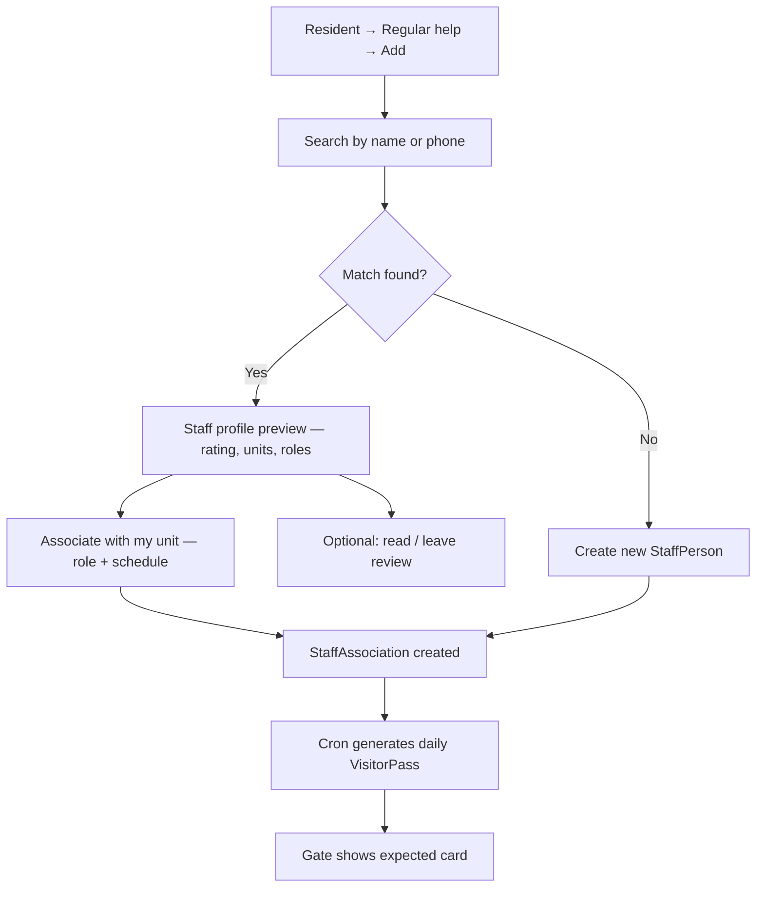
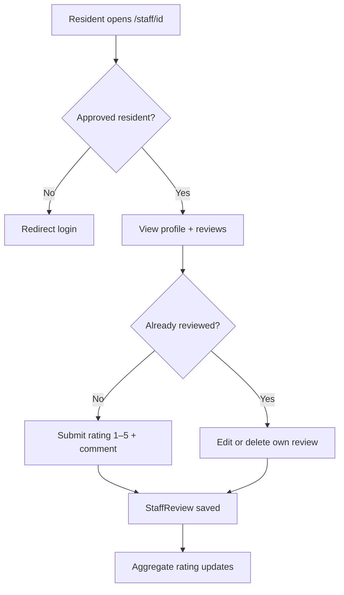
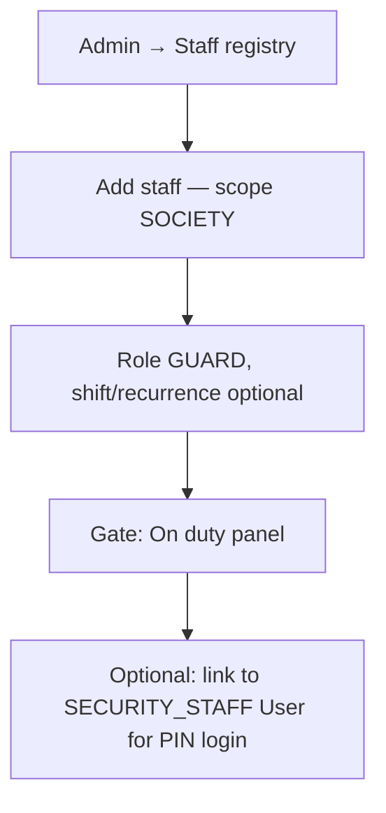
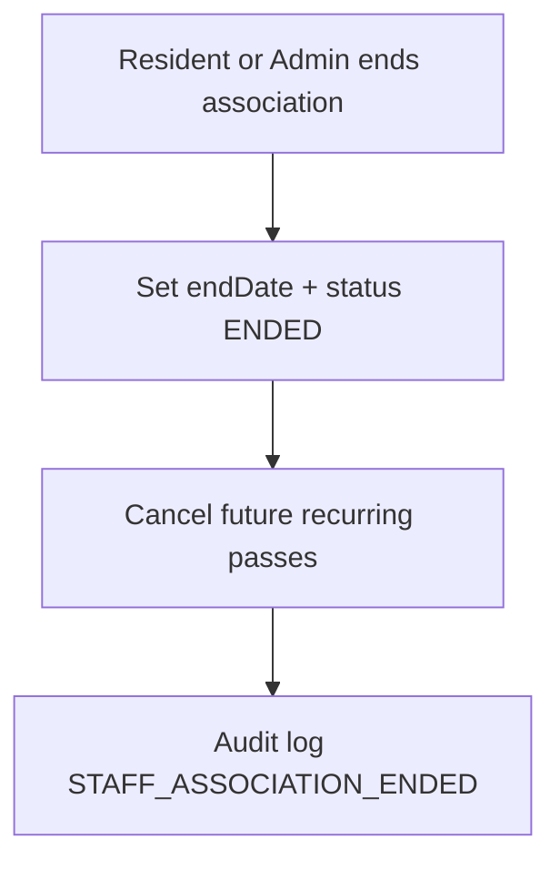

# Staff Registry & Important Contacts — Implementation Backlog

> **Goal:** Two complementary reputation systems for Gulshan Dynasty:
> 1. **Staff registry** — individual non-resident people (maids, guards, trades) with unit/society associations, gate passes, and reviews at `/staff/[id]`.
> 2. **Important contacts** — vendor businesses and service lines with detail pages and community reviews at `/contacts/[id]`.
>
> **Related:** [`functional-spec.md`](../specification/functional-spec.md) §5.11 · [`design-profiles.md`](../specification/design-profiles.md) · [`architecture.md`](./architecture.md) · [`hold-backlog.md`](./hold-backlog.md) (vendor marketplace, Hindi gate UI)
>
> **Created:** 2026-07-07 · **Merged:** 2026-07-07 (contact reviews → this doc)

**Document map:** Part A §1–5 (staff) · Part B §6–9 (contacts) · Shared §10–15 (flows, RBAC, decisions, review, files, acceptance)

---

## Progress Summary

| Metric | Staff (STAFF-*) | Contacts (CONT-*) | **Combined** |
|---|---|---|---|
| Total items | 83 | 30 | **113** |
| Backlog | 70 | 26 | **96** |
| Skipped | 8 | 0 | **8** |
| Done | 0 | 0 | **0** |
| Deferred | 4 | 3 | **7** |
| Cancelled | 1 | 1 | **2** |

**Implementation strategy (decided 2026-07-07):** **Parallel** — one schema sprint (`STAFF-010` + `CONT-010` in a single migration), then staff and contacts UI tracks proceed **independently** (no cross-track blocking except shared `StarRatingInput` / `CONT-035`).

---

# Part A — Staff Registry

## 1. Problem Statement

Residents employ or interact with many people who are **not portal users** but need predictable gate access, audit trails, and (for society) HR-style records:

| Person type | Typical association | Gate access pattern |
|---|---|---|
| Maid / housekeeping | One or more units | Recurring (Mon–Sat) |
| Nanny, cook, driver | Usually one unit | Recurring |
| Gardener | Unit and/or society common areas | Recurring or ad hoc |
| Guard | Society (GD) | Daily shift; not unit-scoped |
| Facility / maintenance crew | Society (GD) | Scheduled or on-call |
| Electrician, plumber | Unit (visit) or society vendor list | One-off or short window |
| Cab / delivery | Unit (visitor pass) | Already covered by `VisitorPass` |

Today the codebase **partially** covers unit recurring help via `DomesticHelp` + `DAILY_HELP` passes, but lacks a unified staff identity, society-level staff, multi-unit links, and most UI wiring.

---

## 2. Current Implementation Audit

### 2.1 What exists

| Area | Implementation | Notes |
|---|---|---|
| **Unit recurring help (schema)** | `DomesticHelp` model | `userId` = registering resident; **required** `unitId`; `helpType` free string; `recurrenceDays[]`; `validFrom` / `validUntil`; `status` ACTIVE \| REVOKED |
| **Help registration API** | `POST/GET /api/domestic-help` | POST checks active unit membership; GET returns **caller's** helps by `userId` (not unit-scoped — wrong for household view) |
| **Help registration UI** | `DomesticHelpForm` component | **Orphaned — not mounted on any page** |
| **Pass auto-generation** | `generateRecurringPasses()` in `src/lib/domestic-help.ts` | Creates `VisitorPass` (type `DAILY_HELP`) by **matching name** — no FK link |
| **Daily pass cron** | — | **`generateRecurringPasses` is never called** (no cron route) |
| **Gate “today's staff”** | `/gate` → `getTodayStaff()` | Lists **active `DAILY_HELP` visitor passes** for today, not `DomesticHelp` registry |
| **Visitor passes** | `VisitorPass` + `/visitors` | Types: GUEST, DELIVERY, **DAILY_HELP**, CAB, OTHER; recurring days supported |
| **Gate validation** | `/gate` + `GateValidation` | OTP validation; **recurring passes stay ACTIVE** (not marked USED); one-time passes marked USED |
| **Gate operators (auth)** | `User.globalRole = SECURITY_STAFF`, `staffPin`, `/api/gate/login` | **Different concept** — portal login for guard **devices**, not registry of guard **employees** |
| **Vendor directory** | `ImportantContact` + `/contacts` | Business phone book (electrician companies, couriers); **no unit link, no dates** |
| **RWA committee** | `Designation` + `/committee` | Elected office bearers (residents); **not operational staff** |
| **Unit profile** | `/units/[unitNumber]` | Shows active visitor passes; **no household staff section** |
| **Seed data** | `prisma/seed.ts` | Sample `DomesticHelp` rows; sample recurring `DAILY_HELP` passes (some without registry row) |

### 2.2 Gaps & inconsistencies

| # | Gap | Impact |
|---|---|---|
| G1 | No unified **staff person** identity — same maid at two flats = duplicate name records | Data quality, gate confusion |
| G2 | `DomesticHelp.userId` ties record to **registering resident**, not staff | Orphan records when resident moves out |
| G3 | `helpType` values differ (`MAID` in form vs `HOUSEKEEPING` in seed) | Filtering, reporting broken |
| G4 | No **society-scoped** staff (GD guards, facility team) | Cannot model non-unit workers |
| G5 | No **revoke / end association** API or UI | Only schema `REVOKED` + `validUntil` unused in API |
| G6 | `DomesticHelp` ↔ `VisitorPass` link is **implicit (name match)** | Duplicate passes, wrong unit on typos |
| G7 | Registration UI not shipped | Feature marked “Implemented” in spec but unreachable |
| G8 | Cron for daily passes missing | BR-21 not enforced in production |
| G9 | `photoUrl` on `DomesticHelp` never shown at gate | Missed guard verification |
| G10 | Electrician/plumber as **individual staff** vs **vendor business** conflated | `/contacts` vs help registry unclear |
| G11 | Privacy rules for staff phone/photo undefined | Directory vs gate visibility |
| G12 | `NON_RESIDENT` global role unused for staff | No staff portal account path |
| G13 | No **search existing staff** flow — every registration creates a duplicate person | Poor dedupe; no community reuse |
| G14 | No **staff profile page** or resident-facing reputation | Residents cannot discover or review help |
| G15 | Help list scoped to **registering user**, not **unit** | Family/tenant cannot see help registered by co-resident |
| G16 | `DomesticHelpForm` includes `GUARD` type on a **unit** form | Wrong scope — guards are society staff |
| G17 | ~~No policy for who may end~~ | **Resolved** — BR-STAFF-22 (any active unit member) |
| G18 | Daily cron may create **duplicate passes** if long-lived recurring pass already exists | Partially mitigated in code; needs FK + idempotent cron |
| G19 | ~~`VisitorPass` single unitId~~ | **Resolved** — Q18: nullable unitId (BR-STAFF-30) |
| G20 | BR-07 (max 10 active passes per **resident**) may count cron-generated staff passes against wrong user | Pass limit logic needs staff pass exemption |
| G21 | ~~No handling when last unit member leaves~~ | **Resolved** — Q14: admin review queue (STAFF-085, STAFF-090) |
| G22 | ~~Staff pass userId/unitId semantics~~ | **Resolved** — BR-STAFF-30/31 |
| G23 | ~~No GET APIs for profile/unit list~~ | **Resolved** — STAFF-086, STAFF-087 |
| G24 | ~~PENDING residents RBAC~~ | **Resolved** — BR-STAFF-32 |
| G25 | Resident associate form may offer **SOCIETY-only roles** (GUARD) on unit flow | STAFF-094 |
| G26 | Gate **`getTodayStaff()`** still queries pass.unit only — won't show multi-unit staff | STAFF-081 scope |
| G27 | Gate validation response lacks **staff phone** for guard verification (BR-STAFF-07) | STAFF-095 |

### 2.3 Business rules (existing + proposed)

| # | Rule | Status |
|---|---|---|
| BR-STAFF-01 | Recurring unit staff must be linked to at least one **active** unit association | Proposed |
| BR-STAFF-02 | Society staff have `scope = SOCIETY`; no unit required | Proposed |
| BR-STAFF-03 | Association `endDate` in the past ⇒ treat as ended; gate passes stop generating | Proposed |
| BR-STAFF-04 | One staff person (phone dedupe) can have **multiple unit associations** with independent dates | Proposed |
| BR-STAFF-05 | Gate sees: name, photo, role, **all destination units** for today | Proposed |
| BR-STAFF-06 | Resident directory **must not** list staff phone numbers | Proposed |
| BR-STAFF-07 | Guards may see staff phone for verification | Proposed |
| BR-STAFF-08 | Max N active unit associations per staff person (configurable, default 5) | Proposed |
| BR-STAFF-09 | Ending association cancels future recurring passes; does not delete history | Proposed |
| BR-STAFF-10 | Occasional trades (electrician visit) use **time-bound visitor pass** OR short association (≤7 days) | Proposed |
| BR-STAFF-11 | Vendor businesses stay in `ImportantContact`; optional link “request visit” → ticket/pass | Proposed |
| BR-STAFF-12 | `SECURITY_STAFF` User role = gate **device login** only; guard **employment** record is separate | Proposed |
| BR-STAFF-13 | **Any active unit member** (owner, tenant, family) may search registry and **associate** existing staff with their unit | Proposed |
| BR-STAFF-14 | Creating a new staff person requires phone; search matches phone (exact) or name (fuzzy) before create | Proposed |
| BR-STAFF-15 | Each `StaffPerson` has one canonical **resident profile** at `/staff/[id]` | Proposed |
| BR-STAFF-16 | Any **approved resident** may leave one rating (1–5) + comment per staff person; may edit or **delete** own review (Q20) | Decided |
| BR-STAFF-17 | Reviews show author via `<UserLink />`; staff phone **not** on public profile | Proposed |
| BR-STAFF-18 | Aggregate rating = average of visible reviews; shown on profile, search results, and help cards | Proposed |
| BR-STAFF-19 | Admin may hide abusive reviews; hidden reviews excluded from aggregate | Proposed |
| BR-STAFF-20 | Reviews allowed only when staff has ≥1 association (active or ended); **society staff reviewable** with stricter moderation | Proposed |
| BR-STAFF-21 | Recurring / daily-help passes **must not** be marked USED on gate validation (already implemented — preserve in v2) | Existing |
| BR-STAFF-22 | **Ending** a unit association: any active unit member of that unit may end; notifies other unit members | Proposed |
| BR-STAFF-23 | `StaffPerson.phone` **required** and `@unique` (resident create); admin merge for edge cases | Decided |
| BR-STAFF-24 | Search + review APIs rate-limited; phone search requires ≥10 digits; never return phone in search results | Proposed |
| BR-STAFF-25 | Creating `StaffPerson` without unit association requires admin (residents always create via associate flow) | Proposed |
| BR-STAFF-26 | Cron-generated **staff passes** exempt from BR-07 per-resident active pass limit | Proposed |
| BR-STAFF-27 | Staff daily pass stores `staffPersonId`; gate resolves **all active unit destinations** from associations (not pass.unitId alone) | Proposed |
| BR-STAFF-28 | Gate validation notifies **all units** linked to staff person when pass is validated | Proposed |
| BR-STAFF-29 | Max **5 active unit associations** per staff person (BR-STAFF-08) enforced in associate API | Proposed |
| BR-STAFF-30 | Staff cron pass: `staffPersonId` set; `unitId` **nullable** when staff-linked (schema change); gate ignores pass.unitId for destinations | Decided |
| BR-STAFF-31 | Staff pass `userId` = **`registeredById`** of oldest active association (notification routing uses STAFF-082, not this field) | Proposed |
| BR-STAFF-32 | Only **`approvalStatus === APPROVED`** residents may search, associate, or review staff | Proposed |
| BR-STAFF-33 | Residents may associate **UNIT-scoped roles only**; GUARD/FACILITY require admin (STAFF-025) | Proposed |
| BR-STAFF-34 | Staff passes keep `visitorType = DAILY_HELP`; distinguished by `staffPersonId` FK | Decided |

---

## 3. Target Domain Model (v2)

Replace `DomesticHelp` with a normalized model (finalize in **STAFF-010**):

```
StaffPerson          — identity (name, phone, photo, optional gov ID hash); phone required @unique
StaffAssociation     — time-bound link: UNIT | SOCIETY, role, recurrence, dates, status, registeredById
StaffReview          — resident rating (1–5) + comment on StaffPerson
VisitorPass          — optional staffPersonId FK; unitId nullable when staffPersonId set;
                       non-staff passes require unitId; destinations via StaffAssociation (BR-STAFF-27)
```

**`StaffAssociation` key fields:** `staffPersonId`, `scope`, `unitId?`, `role`, `recurrenceDays[]`, `startDate`, `endDate?`, `status`, `registeredById`, `needsReview?` (vacant-unit flag, STAFF-090).

**Status enum:** `ACTIVE` | `ENDED` | `SUSPENDED` (admin suspend — e.g. security incident).

### 3.1 Staff categories (`StaffRole` enum)

| Code | Label (resident UI) | Default scope | Recurring gate? |
|---|---|---|---|
| `MAID` | Maid / housekeeping | UNIT | Yes |
| `NANNY` | Nanny | UNIT | Yes |
| `COOK` | Cook | UNIT | Yes |
| `DRIVER` | Driver | UNIT | Yes |
| `GARDENER` | Gardener | UNIT or SOCIETY | Often |
| `GUARD` | Security guard | SOCIETY only | Yes (shift-based) |
| `FACILITY` | Facility / maintenance | SOCIETY | Ad hoc / shift |
| `ELECTRICIAN` | Electrician | UNIT (visit) | One-off |
| `PLUMBER` | Plumber | UNIT (visit) | One-off |
| `OTHER` | Other | Either | Case by case |

### 3.2 Association scopes

| Scope | Meaning | Examples |
|---|---|---|
| `UNIT` | Works for specific flat(s) | Maid for C-1702; plumber visiting A-0101 |
| `SOCIETY` | Employed / contracted by RWA | Gate guards, GD housekeeping, lift technician |

### 3.3 Migration from `DomesticHelp`

| Old field | New mapping |
|---|---|
| `DomesticHelp.name/phone/photoUrl` | `StaffPerson` |
| `DomesticHelp.unitId/role/dates/recurrence` | `StaffAssociation` (scope UNIT) |
| `DomesticHelp.userId` | `StaffAssociation.registeredById` |
| `DomesticHelp.status` | `StaffAssociation.status` |

### 3.4 Staff reviews (`StaffReview`)

| Field | Description |
|---|---|
| `staffPersonId` | Who is being reviewed |
| `authorId` | Resident user (`User.id`) |
| `rating` | Integer 1–5 (required) |
| `comment` | Optional text; max 500 chars |
| `isHidden` | Admin moderation flag (default false) |
| `createdAt` / `updatedAt` | Timestamps |

**Constraints:** `@@unique([staffPersonId, authorId])` — one review per resident per staff person; author may update or delete (Q20).

**Aggregate (computed):** `avgRating`, `reviewCount` on profile; exclude `isHidden = true`.

---

## 4. UI Map — Where Staff Appears

### 4.1 Resident app (casual shell)

| Location | Route / component | Purpose | Primary actions |
|---|---|---|---|
| **Guests hub — tab** | `/visitors?tab=help` (new tab alongside Active / Past) | “Regular help” — my unit’s staff | Search & associate, add new, end association, view pass status |
| **Add / associate flow** | `/visitors/help/add` or sheet on help tab | **Search existing** staff by name/phone, then link to unit; or create new | Primary entry: search → associate (not create-first) |
| **Staff profile** | `/staff/[id]` | **Dedicated page** — photo, roles, units served, avg rating, reviews | Leave/edit review; “Add to my unit” CTA |
| **Guests hub — CTA** | `/visitors/new` | One-off guest/delivery/**daily help pass** (keep) | Create pass without full registry (discouraged for recurring) |
| **Unit profile section** | `/units/[unitNumber]` → “Household staff” | Staff linked to **this unit** | Names link to `/staff/[id]`; associate/search CTA for members |
| **User profile** | `/profile` | Optional summary: “Staff I registered” | Quick links only |
| **Important contacts** | `/contacts` | **Vendor businesses** — detail at `/contacts/[id]`; call on detail page (CONT-Q8) | Tap card → detail; rate & review |
| **Packages** | `/packages` | Unchanged (delivery passes) | — |
| **Hub / Home** | `/` widget (optional P2) | “Help expected today” count | Tap → `/visitors?tab=help` |
| **Mobile bottom nav** | “Guests” tab | Subtitle or sheet entry: “Regular help” | — |
| **Global search** | Cmd+K | Search staff by name; results link to `/staff/[id]` | Resident-visible; phone never in results |

**Microcopy (resident):**

| Avoid | Prefer |
|---|---|
| Domestic help registry | Regular help |
| Staff member | [Name] — [role] |
| Staff profile | [Name]'s profile |
| Leave a review | Rate & review |
| REVOKED | Ended |
| DAILY_HELP | Regular help |

### 4.2 Gate / security (standalone PWA)

| Location | Route | Purpose |
|---|---|---|
| **Today's expected** | `/gate` top panel | Cards: photo, name, role, unit(s), expected time window |
| **OTP validation result** | `/gate` validation panel | Show staff badge + **all destination units** when `staffPersonId` set |
| **Society staff on duty** | `/gate` second panel (P1) | GD guards / facility on today's shift |
| **Package log** | existing `/api/gate/package-received` | Unchanged |
| **PIN login** | gate login flow | Unchanged (`SECURITY_STAFF` device users) |

### 4.3 Admin (enterprise shell)

| Location | Route | Purpose |
|---|---|---|
| **Staff registry** | `/admin/staff` (new) | Master list: all `StaffPerson`, filters by role/scope/status |
| **Staff detail** | `/admin/staff/[id]` | Admin view: associations, pass log, **review moderation** |
| **Society staff** | `/admin/staff?society=1` | Guards, facility — CRUD, shift notes |
| **Unit admin** | `/admin/units/[id]` | Tab: staff associations for unit |
| **Users** | `/admin/users` | **`SECURITY_STAFF` = gate login accounts** (keep separate from employment registry) |
| **Contacts** | `/admin/contacts` or inline on `/contacts` | Vendor businesses |
| **Audit** | `/admin/audit` | STAFF_REGISTERED, STAFF_ASSOCIATION_ENDED, etc. |
| **Export** | `/admin/export` | Staff roster CSV (compliance) |

### 4.4 Key resident files (new)

| # | File | Purpose |
|---|---|---|
| 1 | `src/app/staff/[id]/page.tsx` | Staff profile — header, units, reviews |
| 2 | `src/components/staff/staff-link.tsx` | `<StaffLink />` reusable component |
| 3 | `src/components/staff/staff-search.tsx` | Search + associate typeahead |
| 4 | `src/components/staff/staff-review-form.tsx` | Star rating + comment |
| 5 | `src/components/staff/staff-review-list.tsx` | Paginated reviews |
| 6 | `src/app/api/staff/search/route.ts` | Search endpoint |
| 7 | `src/app/api/staff/[id]/route.ts` | Profile GET (STAFF-086) |
| 8 | `src/app/api/staff/route.ts` | List by unit + POST create (STAFF-087, STAFF-013) |
| 9 | `src/app/api/staff/[id]/associations/route.ts` | Association POST/PATCH (STAFF-014) |
| 10 | `src/app/api/staff/[id]/reviews/route.ts` | Review CRUD |

### 4.5 Staff profile page layout (`/staff/[id]`)

```
┌─────────────────────────────────────────────────────────────────┐
│  HEADER: Photo + Name + primary role badge                       │
│  ★★★★☆ 4.2 (18 reviews)                                         │
│  Active at: [C-1702] [B-1201]  (UnitLink badges)                 │
│  [Add to my unit]  (if viewer is unit member, not yet linked)    │
│  ─────────────────────────────────────────────────────────────── │
│  ┌─── About ──────────────────────────────────────────────────┐ │
│  │  Per unit: C-1702 — Maid (Mon–Fri) · B-1201 — Cook (Mon–Sat)   │ │
│  │  (No phone on public profile)                              │ │
│  └─────────────────────────────────────────────────────────────┘ │
│  ┌─── Your review (or Rate & review) ─────────────────────────┐ │
│  │  ★★★★★  [comment box]  [Submit / Update / Delete]           │ │
│  └─────────────────────────────────────────────────────────────┘ │
│  ┌─── Community reviews ────────────────────────────────────────┐ │
│  │  ★★★★★  Rajesh Sharma (UserLink) · Jan 2026                 │ │
│  │  "Very punctual and thorough."                               │ │
│  │  ★★★☆☆  Priya Nair · Dec 2025                               │ │
│  │  "Good work but often late on Mondays."                      │ │
│  └─────────────────────────────────────────────────────────────┘ │
└─────────────────────────────────────────────────────────────────┘
```

**Visibility:** All approved residents see profile + reviews. Phone and ID docs admin/gate only. Review authors always `UserLink`.

### 4.6 Future / deferred surfaces

| Surface | Notes |
|---|---|
| Staff mobile app / WhatsApp pass | DEFERRED — phone OTP pass share |
| Hindi gate UI | `hold-backlog.md` IMP-504 |
| Biometric / RFID | Out of scope v1 |
| Payroll / attendance | Out of scope v1 |

---

## 5. Implementation Phases

> **Phase 0 note:** **Skip Phase 0** (decided 2026-07-07) — implement Phase 1 v2 schema directly. Phase 0 items retained for reference only if legacy bridge needed later.

### Phase 0 — Fix what we have (interim / optional)

| ID | Description | P | Cplx | Deps | Status |
|---|---|---|---|---|---|
| STAFF-001 | Document target schema (`StaffPerson`, `StaffAssociation`, `StaffReview`) in `architecture.md` | P0 | S | — | SKIPPED |
| STAFF-002 | Normalize `helpType` → enum; align form + seed | P0 | XS | — | SKIPPED |
| STAFF-003 | Wire `DomesticHelpForm` on `/visitors?tab=help` (or `/visitors/help/new`) | P0 | S | — | SKIPPED |
| STAFF-004 | List resident's `DomesticHelp` on help tab with end/revoke action | P0 | M | STAFF-003 | SKIPPED |
| STAFF-005 | `PATCH /api/domestic-help/[id]` — revoke, update days/phone | P0 | S | — | SKIPPED |
| STAFF-006 | Cron `/api/cron/generate-help-passes` calling `generateRecurringPasses()` | P0 | S | — | SKIPPED |
| STAFF-007 | Add `domesticHelpId` FK on `VisitorPass`; set in generator | P0 | M | STAFF-006 | SKIPPED |
| STAFF-008 | Gate panel: show `helpType` + photo from linked `DomesticHelp` | P1 | S | STAFF-007 | SKIPPED |

### Phase 1 — Unified staff identity + search + profiles (unit scope)

> **Order:** Schema (010, **011**) → lib (012) → APIs (055, 086, 087, 014, 013) → UI (016, 063, 017) → **StarRatingInput (CONT-035)** → reviews (060–062) → pass cron (019, 079, 081).

| ID | Description | P | Cplx | Deps | Status |
|---|---|---|---|---|---|
| STAFF-010 | Prisma: models + enums; `VisitorPass.staffPersonId`, nullable `unitId` (**staff-linked passes only**; existing non-staff passes keep `unitId` required); `StaffAssociation.needsReview`; **`ContactReview` + `ImportantContact.createdById` in same migration (CONT-010)**; document in `architecture.md` | P0 | M | — | BACKLOG |
| STAFF-011 | Migration script: `DomesticHelp` → new tables | P0 | M | STAFF-010 | BACKLOG |
| STAFF-012 | `src/lib/staff.ts` — CRUD, active filter, phone dedupe, aggregate rating helper | P0 | M | STAFF-010 | BACKLOG |
| STAFF-055 | API `GET /api/staff/search?q=` — name (contains, **≥2 chars**) + phone (exact, ≥10 digits); no phone in response; rate limit | P0 | M | STAFF-012 | BACKLOG |
| STAFF-086 | API `GET /api/staff/[id]` — profile, associations (active + ended), aggregate rating; no phone in response | P0 | M | STAFF-012 | BACKLOG |
| STAFF-087 | API `GET /api/staff?unitIds=` — list staff for caller's unit(s); used by help tab | P0 | M | STAFF-012 | BACKLOG |
| STAFF-014 | API: `/api/staff/[id]/associations` POST/PATCH — add/end link on **existing** staff; residents **UNIT scope only** (BR-STAFF-33) | P0 | M | STAFF-012 | BACKLOG |
| STAFF-013 | API: `/api/staff` POST — create person + first association atomically (search-first create path); shares lib with STAFF-014 | P0 | M | STAFF-012 | BACKLOG |
| STAFF-015 | RBAC: approved resident + active unit member to associate/end; admin any; see BR-STAFF-22/32 | P0 | S | STAFF-012 | BACKLOG |
| STAFF-056 | Search UI — debounced typeahead, result cards with rating + “Associate with my unit” | P0 | M | STAFF-055 | BACKLOG |
| STAFF-057 | Associate flow: pick unit (multi-unit resident), role, recurrence, start date | P0 | M | STAFF-014, STAFF-056 | BACKLOG |
| STAFF-058 | Block duplicate **active** association (same staff + unit); one role per staff+unit pair | P0 | XS | STAFF-057 | BACKLOG |
| STAFF-016 | `StaffAssociateForm` — search-first + create-new fallback | P0 | M | STAFF-013, STAFF-056 | BACKLOG |
| STAFF-063 | Resident page `/staff/[id]` — consumes STAFF-086; **placeholder/initials photo** (SHARED-Q2), roles by unit, reviews | P0 | L | STAFF-086 | BACKLOG |
| STAFF-059 | `<StaffLink />` — clickable name → `/staff/[id]`; use on unit profile, help tab, gate admin | P0 | S | STAFF-063 | BACKLOG |
| STAFF-064 | “Add to my unit” CTA on staff profile | P1 | M | STAFF-057, STAFF-063 | BACKLOG |
| STAFF-060 | ~~Prisma StaffReview~~ — covered by STAFF-010; verify unique constraint in migration | P0 | XS | STAFF-010 | BACKLOG |
| STAFF-061 | API `GET/POST/PATCH/DELETE /api/staff/[id]/reviews` — delete own review (Q20); rate limit (~10 writes/min per user, mirror CONT-013) | P0 | M | STAFF-060 | BACKLOG |
| STAFF-062 | `StaffReviewForm` — stars + optional comment; edit or delete own; uses **StarRatingInput** (CONT-035) | P0 | M | STAFF-061, CONT-035 | BACKLOG |
| STAFF-065 | Avg rating on profile, search results, help tab cards | P0 | S | STAFF-061 | BACKLOG |
| STAFF-066 | Review list — `UserLink` author, paginated | P0 | M | STAFF-063 | BACKLOG |
| STAFF-067 | RBAC: approved resident; staff must have ≥1 association to be reviewed | P0 | S | STAFF-061 | BACKLOG |
| STAFF-017 | `/visitors?tab=help` — third tab; list via STAFF-087; empty state if no unit membership | P0 | M | STAFF-087, STAFF-016 | BACKLOG |
| STAFF-088 | Help tab: **End association** action (confirm dialog → PATCH); unit notification deferred to STAFF-077 (P1) | P0 | S | STAFF-014, STAFF-017 | BACKLOG |
| STAFF-072 | Help tab: show which unit each association belongs to; link to `/staff/[id]` | P0 | S | STAFF-017 | BACKLOG |
| STAFF-094 | Associate form + API: filter to **UNIT-scoped roles** only (exclude GUARD, FACILITY for residents) | P0 | XS | STAFF-057 | BACKLOG |
| STAFF-019 | Pass generator: one daily pass per `StaffPerson`; `DAILY_HELP` + `staffPersonId` (BR-STAFF-34); idempotent | P0 | M | STAFF-011 | BACKLOG |
| STAFF-079 | Cron route `/api/cron/generate-staff-passes` (6 AM IST); wire in `vercel.json` / deploy docs | P0 | S | STAFF-019 | BACKLOG |
| STAFF-080 | Exempt staff passes from BR-07 resident pass limit in `/api/visitors` | P0 | XS | STAFF-019 | BACKLOG |
| STAFF-081 | Refactor `getTodayStaff()` + gate validate: resolve **all units** + **placeholder/initials photo** (SHARED-Q2) when `staffPersonId` set | P0 | M | STAFF-019 | BACKLOG |
| STAFF-095 | Gate validate API: include **staff phone** in guard-only response (BR-STAFF-07); never in resident APIs | P0 | S | STAFF-081 | BACKLOG |
| STAFF-082 | Gate validation notifies **all active members** of linked units (reuse `VISITOR_ARRIVED`) | P1 | S | STAFF-081 | BACKLOG |
| STAFF-083 | Enforce BR-STAFF-08 max 5 active unit associations in associate API | P1 | XS | STAFF-057 | BACKLOG |
| STAFF-084 | Profile + API: show ended associations as “Previously at [unit]” (Q13) — **MVP** per §15 | P0 | S | STAFF-063 | BACKLOG |
| STAFF-085 | Admin queue: associations flagged when unit has zero active members (Q14); resolve/end from `/admin/staff` | P2 | M | STAFF-026, STAFF-090 | BACKLOG |
| STAFF-090 | Detect vacant units (cron or on membership end): set `needsReview` on orphaned associations | P2 | S | STAFF-014 | BACKLOG |
| STAFF-089 | `microcopy.ts` — regular help tab, associate flow, review labels (see §4.1 microcopy table) | P0 | XS | — | BACKLOG |
| STAFF-074 | Visitor pass detail links to `/staff/[id]` when FK present | P1 | XS | STAFF-019 | BACKLOG |
| STAFF-077 | Notify all active unit members when staff associated or ended — **P1** (deferred from MVP; SHARED-Q5) | P1 | S | STAFF-014 | BACKLOG |
| STAFF-073 | `/staff/*` — **login required**; approved resident for search/associate/review; **pending users read-only** on profile (SHARED-Q4) | P0 | XS | STAFF-063 | BACKLOG |
| STAFF-092 | Audit (Phase 1): log associate + end in `STAFF-014`; full lifecycle in STAFF-029 | P1 | XS | STAFF-014 | BACKLOG |
| STAFF-018 | Unit profile “Household staff” section | P1 | M | STAFF-014, STAFF-059 | BACKLOG |
| STAFF-070 | Document staff profile in `design-profiles.md` + `<StaffLink />` convention | P1 | S | STAFF-063 | BACKLOG |
| STAFF-020 | Deprecate `DomesticHelp` after migration | P1 | S | STAFF-011 | BACKLOG |

### Phase 2 — Society staff & admin registry

| ID | Description | P | Cplx | Deps | Status |
|---|---|---|---|---|---|
| STAFF-025 | Society-scoped associations (`scope = SOCIETY`) — guards, facility | P1 | M | STAFF-010 | BACKLOG |
| STAFF-026 | Admin `/admin/staff` list + filters (role, scope, active) | P1 | L | STAFF-025 | BACKLOG |
| STAFF-027 | Admin `/admin/staff/[id]` detail — timeline, pass log | P1 | M | STAFF-026 | BACKLOG |
| STAFF-028 | Gate: “On duty today” panel for society staff | P1 | M | STAFF-025 | BACKLOG |
| STAFF-029 | Audit log: `STAFF_PERSON_CREATED`, `STAFF_ASSOCIATION_*`, `STAFF_REVIEW_*` (extends STAFF-092) | P1 | S | STAFF-092 | BACKLOG |
| STAFF-068 | Admin hide/unhide review; recalc aggregate; **required for society staff profiles** | P1 | M | STAFF-026, STAFF-061 | BACKLOG |
| STAFF-069 | Audit: `STAFF_REVIEW_CREATED`, `STAFF_REVIEW_HIDDEN` | P2 | XS | STAFF-061 | BACKLOG |
| STAFF-078 | Review policy doc: defamation, dispute process, society staff moderation | P1 | S | STAFF-068 | BACKLOG |
| STAFF-030 | Admin CSV export — active staff roster | P2 | S | STAFF-026 | BACKLOG |
| STAFF-031 | Clarify admin UI copy: **Gate login users** vs **Staff registry** | P1 | XS | — | BACKLOG |

### Phase 3 — Compliance, photos, gate UX

| ID | Description | P | Cplx | Deps | Status |
|---|---|---|---|---|---|
| STAFF-036 | Gate **“Today's expected”** panel cards: photo, role, **all units** (UI polish; logic in STAFF-081) | P1 | S | STAFF-081 | BACKLOG |
| STAFF-037 | Optional ID fields on `StaffPerson` (last-4 Aadhaar, police verify date) — admin only | P2 | M | STAFF-026 | BACKLOG |
| STAFF-038 | Photo upload for staff (MinIO) — resident + admin | P1 | M | STAFF-016 | BACKLOG |
| STAFF-039 | Validation: warn if same phone registered with conflicting name | P2 | S | STAFF-012 | BACKLOG |
| STAFF-040 | End association → auto-cancel future recurring passes | P1 | S | STAFF-019 | BACKLOG |
| STAFF-041 | Unit leader can view (not edit) household staff for led unit | P2 | S | UL-012 | BACKLOG |
| STAFF-071 | Admin merge duplicate `StaffPerson` records (same phone / admin judgment) | P2 | M | STAFF-026 | BACKLOG |

### Phase 4 — Trades, vendors, search

| ID | Description | P | Cplx | Deps | Status |
|---|---|---|---|---|---|
| STAFF-045 | Short-term unit association for electrician/plumber visit (≤7 days) | P2 | M | STAFF-014 | BACKLOG |
| STAFF-046 | `/contacts` — cross-link “Regular help (maids)” vs vendor contacts; depends **CONT-023** | P2 | XS | CONT-023 | BACKLOG |
| STAFF-047 | “Request vendor visit” → pre-filled ticket or one-day pass | P2 | L | STAFF-045 | BACKLOG |
| STAFF-048 | Global search: staff names → `/staff/[id]` (resident-visible, no phone) | P1 | M | STAFF-063, SRCH-* | BACKLOG |
| STAFF-049 | Hub widget: help expected today (count) | P2 | S | STAFF-017 | BACKLOG |

### Phase 5 — Notifications & polish

| ID | Description | P | Cplx | Deps | Status |
|---|---|---|---|---|---|
| STAFF-050 | ~~Notify resident on pass validation~~ — **CANCELLED**; superseded by STAFF-082 | — | — | — | CANCELLED |
| STAFF-051 | Notify resident 3 days before association `endDate` | P2 | S | STAFF-014 | BACKLOG |
| STAFF-052 | FriendlyBadge mapping for staff association status | P2 | XS | — | BACKLOG |
| STAFF-053 | Update `functional-spec.md` §5.11 + BR-21; remove “Implemented” overclaim | P1 | S | STAFF-017 | BACKLOG |
| STAFF-054 | Seed v2 sample data (multi-unit maid, society guard) | P2 | S | STAFF-011 | BACKLOG |

### Deferred (cross-reference)

| ID | Description | Notes |
|---|---|---|
| STAFF-D01 | Staff portal login (`NON_RESIDENT` or dedicated role) | Needs product decision |
| STAFF-D02 | Hindi gate UI | `hold-backlog.md` IMP-504 |
| STAFF-D03 | Vendor marketplace / in-app booking | `hold-backlog.md` vendor directory |
| STAFF-D04 | Attendance / shift scheduling for guards | Phase 3+ society ops |

---

# Part B — Important Contacts

## 6. Important Contacts — Problem Statement

`/contacts` is a useful **vendor & services phone book** (electricians, couriers, dry cleaners, club booking, etc.) but today:

- Contacts appear only as **flat cards** — no detail page, no history, no community feedback
- Residents cannot share **experience ratings** (“reliable plumber”, “slow courier”)
- No `<ContactLink />` pattern for cross-linking from tickets, hub, or search

**Staff registry** (`/staff/[id]`, Part A) covers **individual people** linked to units. **Important contacts** cover **businesses and service lines** — complementary, not duplicate.

| Dimension | Staff (`/staff/[id]`) | Contact (`/contacts/[id]`) |
|---|---|---|
| Entity | Individual person | Business / service line |
| Unit link | Yes (`StaffAssociation`) | No |
| Gate passes | Yes | No |
| Phone on public page | No | Yes |
| Reviews | `StaffReview` | `ContactReview` |
| Example | Kamla (maid) | Lakshay Laundry, DTDC Courier |

**STAFF-046** cross-link depends on **CONT-023**.

---

## 7. Important Contacts — Audit & Business Rules

### 7.1 What exists

| Area | Implementation | Notes |
|---|---|---|
| **Schema** | `ImportantContact` | `category`, `typeOfService`, `name?`, `contactNo`, `remarks?`, `lastEditedById`, `lastEditedAt`, `createdAt` — **no `createdById`** (G-CONT-12) |
| **List page** | `/contacts` + `ContactsList` | Category filters, search, tel: links |
| **API** | `POST/PATCH /api/contacts` | Create + update; audit log on change |
| **Create UX** | Any **authenticated** user can add | No approval check; not admin-only |
| **Edit UX** | Creator or admin can edit | Inline edit on card |
| **Seed** | `prisma/seed-contacts.ts` | ~80 contacts across 15+ categories |
| **Admin** | No separate `/admin/contacts` | Managed on same resident page |

### 7.2 Gaps

| # | Gap | Impact |
|---|---|---|
| G-CONT-1 | No **`/contacts/[id]`** detail page | Cannot deep-link or review |
| G-CONT-2 | No **reviews / ratings** model or UI | No community reputation |
| G-CONT-3 | List cards **not clickable** — dead-end UX | Users call but never discover reviews |
| G-CONT-4 | No **GET `/api/contacts/[id]`** | Detail page has no API |
| G-CONT-5 | Create contact allows **unapproved** users | Inconsistent with staff/search RBAC |
| G-CONT-6 | `category` / `typeOfService` are **free strings** | Hard to enforce review rules by category |
| G-CONT-7 | No aggregate **avg rating** on list or search | Discovery suffers |
| G-CONT-8 | No link convention in `design-profiles.md` | Inconsistent with `UserLink`, `StaffLink` |
| G-CONT-9 | List page has **no batch aggregate query** for review stats | N+1 or missing ★ on cards |
| G-CONT-10 | `PATCH /api/contacts` lacks **approval check** | Pending users can edit |
| G-CONT-11 | **Inline edit on list card** conflicts with Q8 (whole card → detail) | Edit must move to detail page (CONT-036) |
| G-CONT-12 | No **`createdById`** — only `lastEditedById`; CONT-Q10 “Added by” needs schema field | CONT-010 must add field + backfill from audit/`lastEditedById` |

### 7.3 Business rules (BR-CONT-*)

| # | Rule | Status |
|---|---|---|
| BR-CONT-01 | Each contact has canonical page at **`/contacts/[id]`** | Decided |
| BR-CONT-02 | Approved residents: one review (1–5 + comment) per contact; edit/delete own | Decided |
| BR-CONT-03 | Reviews use `<UserLink />`; hidden reviews excluded from aggregate | Decided |
| BR-CONT-04 | Phone shown on detail page (vendor directory) | Decided |
| BR-CONT-05 | **`Internal Intercom`** category not reviewable | Decided |
| BR-CONT-06 | **`Internal`** RWA lines reviewable; admin moderation (CONT-026) | Decided |
| BR-CONT-07 | Admin may hide abusive reviews | Proposed |
| BR-CONT-08 | Create contact requires approved resident | Decided |
| BR-CONT-09 | Staff = individuals; contacts = businesses — cross-link in UI | Decided |
| BR-CONT-10 | List search unchanged; detail = review hub | Decided |
| BR-CONT-11 | Review API rate-limited (~10 writes/min per user) | Proposed |
| BR-CONT-12 | List cards tap→detail only; call CTA on detail (CONT-Q8) | Decided |
| BR-CONT-13 | Edit contact on detail page only (CONT-Q9) | Decided |

---

## 8. Important Contacts — Domain Model & UI

```
ImportantContact  — add `createdById`, `reviews ContactReview[]`
ContactReview     — contactId, authorId, rating (1–5), comment?, isHidden
User              — add `contactReviews ContactReview[]`, `createdContacts ImportantContact[]`
```

**Constraint:** `@@unique([contactId, authorId])` — one review per resident per contact.

**Aggregate (computed):** `avgRating`, `reviewCount`; exclude `isHidden = true`.

> **Reuse:** Mirror staff patterns (`StaffReview`, `StaffReviewForm`). Shared `StarRatingInput` via CONT-035 / STAFF-062.

### 8.1 Contact detail page layout (`/contacts/[id]`)

```
┌─────────────────────────────────────────────────────────────────┐
│  HEADER: [Category badge] · typeOfService                        │
│  Name (if set)                                                   │
│  ★★★★☆ 4.1 (12 reviews)                                         │
│  [Call] tel: link (primary CTA)                                  │
│  ─────────────────────────────────────────────────────────────── │
│  ┌─── About ──────────────────────────────────────────────────┐ │
│  │  Category · Service type · Remarks                           │ │
│  │  Added by [UserLink] · Last updated by [UserLink] if editor ≠ creator (CONT-Q10/Q11) │ │
│  └─────────────────────────────────────────────────────────────┘ │
│  ┌─── Your review (or Rate & review) ─────────────────────────┐ │
│  │  ★★★★★  [comment box]  [Submit / Update / Delete]          │ │
│  └─────────────────────────────────────────────────────────────┘ │
│  ┌─── Community reviews ────────────────────────────────────────┐ │
│  │  ★★★★★  Rajesh Sharma (UserLink) · Jan 2026                 │ │
│  │  "Fixed the leak same day, fair price."                      │ │
│  └─────────────────────────────────────────────────────────────┘ │
│  ── Not regular help? → /visitors?tab=help (CONT-023) ─────────── │
└─────────────────────────────────────────────────────────────────┘
```

### 8.2 Key files (new)

| File | Purpose |
|---|---|
| `src/app/contacts/[id]/page.tsx` | Detail page |
| `src/components/contacts/contact-link.tsx` | `<ContactLink />` |
| `src/components/contacts/contact-review-form.tsx` | Stars + comment |
| `src/components/contacts/contact-review-list.tsx` | Paginated reviews |
| `src/app/api/contacts/[id]/route.ts` | GET profile + aggregate |
| `src/app/api/contacts/[id]/reviews/route.ts` | Review CRUD |

---

## 9. Important Contacts — Implementation Phases

> **Order:** CONT-010 → 011 → 033 → 012/013 → **CONT-035** → 014 → 015/036 → 016/017 → RBAC (018, 021, 022, 034)

### Phase 1 — Detail pages + reviews (MVP)

| ID | Description | P | Cplx | Deps | Status |
|---|---|---|---|---|---|
| CONT-010 | Prisma: `ContactReview` + relations; `ImportantContact.createdById` (backfill existing rows); `@@unique([contactId, authorId])` — **joint migration with STAFF-010** | P0 | S | — | BACKLOG |
| CONT-011 | `src/lib/contact-reviews.ts` — aggregate, batch aggregates for contact IDs | P0 | S | CONT-010 | BACKLOG |
| CONT-033 | `contacts/page.tsx` — batch avgRating/reviewCount (no N+1) | P0 | S | CONT-011 | BACKLOG |
| CONT-012 | API `GET /api/contacts/[id]` — contact + avgRating + `reviewable` + `createdBy`/`lastEditedBy` (UserLink fields) | P0 | S | CONT-011 | BACKLOG |
| CONT-013 | API review CRUD + paginated GET; rate limit; approved only; 403 if not reviewable | P0 | M | CONT-010, CONT-018 | BACKLOG |
| CONT-014 | Page `/contacts/[id]` — header, call CTA, reviews, **Added by UserLink** + conditional **Last updated by** (CONT-Q10/Q11); `force-dynamic` | P0 | L | CONT-012 | BACKLOG |
| CONT-015 | `ContactsList` — `Link` to detail; remove tel: + inline edit; show ★ avg | P0 | M | CONT-033 | BACKLOG |
| CONT-036 | Detail page edit for creator/admin (moved from list) | P0 | M | CONT-014, CONT-034 | BACKLOG |
| CONT-016 | `ContactReviewForm` — edit/delete own; uses shared **StarRatingInput** (CONT-035) | P0 | M | CONT-013, CONT-035 | BACKLOG |
| CONT-017 | `ContactReviewList` — `UserLink`, paginated, `EmptyState` | P0 | M | CONT-013, CONT-014 | BACKLOG |
| CONT-018 | RBAC: `reviewable = category !== "Internal Intercom"` (exact match; shared helper — G-CONT-6) | P0 | XS | CONT-010 | BACKLOG |
| CONT-019 | `<ContactLink />` → `/contacts/[id]` | P0 | S | CONT-014 | BACKLOG |
| CONT-020 | `microcopy.ts` — contact review labels | P0 | XS | — | BACKLOG |
| CONT-021 | Login required; reviews need approved resident | P0 | XS | CONT-014 | BACKLOG |
| CONT-022 | `POST /api/contacts` — approved resident only; set **`createdById`** + `lastEditedById` | P0 | XS | CONT-010 | BACKLOG |
| CONT-034 | `PATCH /api/contacts` — approved resident (own) or admin | P0 | XS | — | BACKLOG |
| CONT-035 | Shared `StarRatingInput` in `src/components/shared/` — used by STAFF-062 + CONT-016 | P0 | S | — | BACKLOG |
| CONT-023 | Cross-link banner → `/visitors?tab=help` | P1 | XS | CONT-014 | BACKLOG |
| CONT-024 | Document `<ContactLink />` in `design-profiles.md` | P1 | S | CONT-019 | BACKLOG |
| CONT-025 | Seed sample reviews in `prisma/seed-contacts.ts` | P2 | XS | CONT-010 | BACKLOG |

### Phase 2 — Admin, search, polish

| ID | Description | P | Cplx | Deps | Status |
|---|---|---|---|---|---|
| CONT-026 | Admin hide/unhide review; recalc aggregate | P1 | M | CONT-013 | BACKLOG |
| CONT-027 | Audit: `CONTACT_REVIEW_CREATED`, `CONTACT_REVIEW_HIDDEN` | P2 | XS | CONT-026 | BACKLOG |
| CONT-028 | Global search → `/contacts/[id]` (depends `SRCH-*`) | P1 | M | CONT-014, SRCH-* | BACKLOG |
| CONT-029 | ~~Admin-only create~~ — **CANCELLED** (CONT-Q2) | — | — | — | CANCELLED |
| CONT-030 | Review policy doc (defamation, disputes) | P2 | S | CONT-026 | BACKLOG |
| CONT-031 | Hub widget: top-rated contacts | P2 | S | CONT-015 | BACKLOG |
| CONT-032 | Update `functional-spec.md` — vendor directory + reviews | P1 | S | CONT-014 | BACKLOG |

### Deferred (contacts)

| ID | Description | Notes |
|---|---|---|
| CONT-D01 | “Request visit” → ticket | See STAFF-047 |
| CONT-D02 | Vendor marketplace | `hold-backlog.md` |
| CONT-D03 | Photo/logo upload | MinIO; post-MVP |

---

## 10. Shared — Key Flows

### 10.1 Staff — associate existing maid (search-first)



### 10.2 Staff — leave a review



### 10.3 Staff — admin registers society guard



### 10.4 Staff — end association



### 10.5 Contacts — review a vendor

```mermaid
flowchart TD
    A[Resident → Contacts → vendor card] --> B[/contacts/id]
    B --> C{Approved resident?}
    C -->|No| D[Login / pending message]
    C -->|Yes| E[View detail + existing reviews]
    E --> F{Already reviewed?}
    F -->|No| G[Submit rating + comment]
    F -->|Yes| H[Edit or delete own review]
    G --> I[Aggregate updates on list cards]
    H --> I
```

---

## 11. Shared — RBAC Summary

### 11.1 Staff

| Action | Owner/Tenant | Family | Unit leader | Admin | Guard (device) | Any approved resident |
|---|---|---|---|---|---|---|
| Search staff registry | ✅ | ✅ | ✅ | ✅ | ❌ | ✅ (approved only) |
| Associate staff with own unit | ✅ | ✅ | ✅ | ✅ | ❌ | ❌ (approved + unit member) |
| End unit association | ✅ own unit | ✅ own unit | ✅ if unit member | ✅ | ❌ | ❌ |
| View staff profile `/staff/[id]` | ✅ | ✅ | ✅ | ✅ | ✅ name only | ✅ (login; pending read-only) |
| Leave / edit / delete review | ✅ | ✅ | ✅ | ✅ | ❌ | ✅ |
| View staff phone | ❌ public profile | ❌ | ❌ | ✅ | ✅ | ❌ |
| Manage society staff | ❌ | ❌ | ❌ | ✅ | View | ❌ |
| Moderate reviews | ❌ | ❌ | ❌ | ✅ | ❌ | ❌ |
| Gate login PIN | ❌ | ❌ | ❌ | Admin sets | ✅ | ❌ |

### 11.2 Contacts

| Action | Approved resident | Pending resident | Admin |
|---|---|---|---|
| View `/contacts` list or detail | ✅ | ✅ | ✅ |
| Call on detail page | ✅ | ✅ | ✅ |
| Call / tel: on list cards | ❌ | ❌ | ❌ |
| Leave / edit / delete review | ✅ | ❌ | ✅ |
| Review Internal Intercom | ❌ | ❌ | ❌ |
| Review Internal (RWA services) | ✅ | ❌ | ✅ (moderation CONT-026) |
| Add new contact | ✅ | ❌ | ✅ |
| Edit contact (detail page) | Own or admin | ❌ | ✅ |
| Hide reviews | ❌ | ❌ | ✅ |

---

## 12. Shared — Product Decisions

### 12.1 Staff (Q1–Q22)

| # | Question | Status |
|---|---|---|
| Q1 | Who can associate staff with a unit? | **Decided:** any active unit member (owner, tenant, family) |
| Q2 | Same maid at 2 units — one pass or two? | **Decided:** one pass; gate resolves all units via `staffPersonId` (STAFF-081) |
| Q3 | Merge `SECURITY_STAFF` user with guard employment record? | **Decided:** separate; optional link (STAFF-031) |
| Q4 | Police verification mandatory for society staff? | **Decided:** optional everywhere — admin adds ID/verify fields when available (STAFF-037) |
| Q5 | Keep ad-hoc DAILY_HELP passes without registry? | **Decided:** yes for one-offs; nudge recurring to registry |
| Q6 | Can residents review staff they don't employ? | **Decided:** yes — any approved resident |
| Q7 | Show negative reviews to staff subject? | **Decided:** no staff login v1; admin mediates (STAFF-078) |
| Q8 | Review without comment allowed? | **Decided:** yes — rating-only OK |
| Q9 | Family members associate/end staff? | **Decided:** yes — same as owner/tenant |
| Q10 | Who can end an association? | **Decided:** any active unit member of that unit |
| Q11 | Public reviews of society guards? | **Decided:** yes — with moderation (STAFF-068) |
| Q12 | Phone required on create? | **Decided:** yes — unique dedupe key |
| Q13 | Show ended associations on profile? | **Decided:** yes — “Previously at [unit]” (STAFF-084) |
| Q14 | Auto-end associations when unit has zero active members? | **Decided:** flag for **admin review** — no auto-end (STAFF-085) |
| Q15 | Skip Phase 0 legacy DomesticHelp bridge? | **Decided:** yes — Phase 1 v2 schema directly |
| Q16 | Society guard shift model? | **Decided:** one `StaffPerson` per guard; recurrence on association (v1.1) |
| Q17 | Same staff + unit, different roles? | **Decided:** block — one active association per staff+unit |
| Q18 | Staff pass `unitId` when multi-unit? | **Decided:** nullable when `staffPersonId` set (BR-STAFF-30) |
| Q19 | Photo required at staff create? | **Decided:** optional until STAFF-038 upload |
| Q20 | Delete own review? | **Decided:** allow delete — can re-review later |
| Q21 | Staff pass visitor type? | **Decided:** keep `DAILY_HELP` + `staffPersonId` FK (BR-STAFF-34) |
| Q22 | Name search minimum length? | **Decided:** ≥2 chars for name; phone ≥10 digits (BR-STAFF-24) |

### 12.2 Important contacts (CONT-Q1–Q11)

| # | Question | Status |
|---|---|---|
| CONT-Q1 | Who can review contacts? | **Decided:** any approved resident (same as staff) |
| CONT-Q2 | Who can **create** new contacts? | **Decided:** approved residents (CONT-022) |
| CONT-Q3 | Review **Internal Intercom** entries? | **Decided:** no — not services (BR-CONT-05) |
| CONT-Q4 | Show phone on detail page? | **Decided:** yes — vendor directory purpose (BR-CONT-04) |
| CONT-Q5 | Delete own review? | **Decided:** yes — same as staff Q20 |
| CONT-Q6 | Rating on list cards? | **Decided:** yes — avg + count on `/contacts` cards |
| CONT-Q7 | Review **`Internal`** RWA lines? | **Decided:** yes — with admin moderation (CONT-026); confirmed 2026-07-07 |
| CONT-Q8 | List card tap behavior? | **Decided:** tap → detail; call on detail only (BR-CONT-12) |
| CONT-Q9 | Where to edit contact details? | **Decided:** detail page only (BR-CONT-13, CONT-036) |
| CONT-Q10 | Show who added the contact? | **Decided:** yes — “Added by [UserLink]” on detail page (CONT-014) |
| CONT-Q11 | Show last editor when ≠ creator? | **Decided:** yes — “Last updated by [UserLink]” only when editor differs from creator |

### 12.3 Cross-track (SHARED-Q*)

| # | Question | Status |
|---|---|---|
| SHARED-Q1 | Build order across staff vs contacts? | **Decided:** parallel — joint schema sprint (`STAFF-010` + `CONT-010`), then independent UI tracks |
| SHARED-Q2 | Staff photo in MVP before STAFF-038 upload? | **Decided:** placeholder / initials avatar at gate + profile until MinIO upload ships |
| SHARED-Q3 | Individuals in “Regular Services” contacts vs staff registry? | **Decided:** keep both — no migration; maids/cooks → staff; newspaper/presswala etc. stay in `/contacts` |
| SHARED-Q4 | Pending residents on `/staff/[id]`? | **Decided:** read-only — view profile + reviews; search/associate/review require approval |
| SHARED-Q5 | Notify unit on associate/end in MVP? | **Decided:** defer — STAFF-088 ships end UI; STAFF-077 notifications in P1 |

---

## 13. Shared — Review Findings

### Pass 1 (2026-07-07)

| Issue | Fix |
|---|---|
| Phase 1 / 1b dependency cycle | Merged phases; explicit build order |
| STAFF-035 duplicated multi-unit | Removed; folded into pass generator |
| GET domestic-help scoped to user not unit | G15 + STAFF-017 |
| Phase 0 throwaway schema | Marked interim/optional |
| MVP scope creep | Split MVP vs v1.1 acceptance |

### Pass 2 (2026-07-07)

| Issue | Fix |
|---|---|
| Multi-unit pass vs single `VisitorPass.unitId` | G19, BR-STAFF-27/28, STAFF-081/082 |
| Staff passes counted against BR-07 limit | G20, BR-STAFF-26, STAFF-080 |
| No v2 cron route item | STAFF-079 |
| BR-STAFF-23 contradicted required phone | Aligned with Q12 |
| Max 5 associations not enforced | BR-STAFF-29, STAFF-083 |
| STAFF-060 duplicated STAFF-010 | Clarified as verify-only |
| Q13 undecided | Decided yes → STAFF-084 |

### Pass 3 — Product decisions (2026-07-07)

| Decision | Your choice |
|---|---|
| Q4 ID verification | Optional everywhere; admin adds when available |
| Q14 vacant unit | Flag for admin review — no auto-end → STAFF-085 |
| Phase 0 | Skip — Phase 1 v2 directly |
| STAFF-050 | Cancelled → STAFF-082 only |
| Guard shifts | One record per guard; recurrence on association |
| STAFF-058 | One active association per staff+unit |
| Q18 pass unitId | Nullable when staffPersonId set |
| Q19 photo | Optional at create |
| Q20 delete review | Allow delete own review |
| Q22 name search | ≥2 chars minimum |

### Pass 4 (2026-07-07)

| Issue | Fix |
|---|---|
| Phase 0 still BACKLOG despite Q15 skip | Marked SKIPPED; counts adjusted |
| Progress total off by one (76 vs 75) | Recounted: 80 total |
| Missing GET profile + unit list APIs | STAFF-086, STAFF-087 |
| End association UI not explicit | STAFF-088 |
| Vacant unit flag has no trigger | STAFF-090 → STAFF-085 |
| Pass userId/unitId undefined | BR-STAFF-30/31; STAFF-010 nullable unitId |
| PENDING residents RBAC gap | BR-STAFF-32 |
| microcopy not tracked | STAFF-089 |
| Profile wireframe implied multi-role same unit | Fixed per Q17 |
| `backlog.md` footer stale (59 items) | Updated |

### Pass 5 (2026-07-07)

| Issue | Fix |
|---|---|
| Item counts wrong (80/65 vs actual 81/68) | Progress summary corrected |
| Resolved gaps still listed as open (G19–G24) | Marked resolved |
| GUARD on unit form not blocked in Phase 1 | BR-STAFF-33, STAFF-094 |
| `getTodayStaff()` multi-unit not in STAFF-081 | Expanded STAFF-081 scope |
| Gate phone for staff (BR-STAFF-07) missing | STAFF-095 |
| `needsReview` field not in schema | Added to STAFF-010 / StaffAssociation |
| STAFF-092 misplaced in Phase 2 | Moved to Phase 1 |
| BR-STAFF-16 / review constraint missing delete | Aligned with Q20 |
| BR-STAFF-34 visitor type undecided | Q21 decided: DAILY_HELP + FK |

### Pass 6 — Merge review (2026-07-07)

| Issue | Fix |
|---|---|
| Duplicate Part B block at end of file (§12–19) | Removed; single Part B §6–9 retained |
| Section numbering collision (two §9, two §10) | Renumbered shared sections §10–15 |
| Document map pointed to wrong section range | Updated to §6–9 + §10–15 |
| Part B §7 audit too thin vs contact backlog | Expanded with G-CONT-1–11 gap table |
| Part B §8 missing wireframe + file list | Added §8.1 layout + §8.2 key files |
| CONT-Q table missing header + CONT-Q1 row | Fixed |
| Contact review findings only in deleted duplicate | Folded into Pass 6 (counts, N+1, PATCH, edit/tel) |
| CONT-016 (P0) depended on CONT-035 (P1) | CONT-035 promoted to P0; added to both build orders |
| User decisions (2026-07-07) | SHARED-Q1 parallel schema; CONT-Q10 creator attribution; CONT-Q7 Internal reviews confirmed |

### Pass 7 (2026-07-07)

| Issue | Fix |
|---|---|
| `ImportantContact` has no `createdById` — CONT-Q10 blocked | G-CONT-12; CONT-010 adds field + backfill; CONT-022 sets on create |
| STAFF-084 P1 but listed in MVP acceptance §15 | Promoted STAFF-084 to P0 |
| STAFF-013 depended on STAFF-014 (circular ordering) | STAFF-013 → STAFF-012 only; 014 for existing-staff associate |
| Phase 1 build order omitted STAFF-011 migration | Added after STAFF-010 |
| Staff profile wireframe missing Delete (Q20) | Added to §4.5 |
| §4.4 files list missing associations API route | Added `staff/[id]/associations/route.ts` |
| §12.2 header said Q1–Q9 but included Q10 | Renamed to CONT-Q1–Q10 |
| RBAC missing Internal category review row | Added to §11.2 |
| §14 Phase 4 implied contacts work in staff Phase 4 | Clarified STAFF-046 cross-link only |
| Pass 7 user decisions | CONT-Q11 attribution; SHARED-Q2 placeholder photo; SHARED-Q3 keep Regular Services overlap |

### Pass 8 (2026-07-07)

| Issue | Fix |
|---|---|
| Contacts MVP acceptance #11 wrongly copied staff photo criterion (SHARED-Q2) | Replaced with pending-resident UX criterion |
| Staff MVP missing 404 acceptance for invalid `/staff/[id]` | Added criterion #13 |
| STAFF-088 claimed notify on end but STAFF-077 is P1 | End-association MVP ships without notify; STAFF-077 adds it |
| STAFF-061 lacked review rate limit (CONT-013 has one) | Added to STAFF-061 + BR-STAFF-24 |
| STAFF-010 did not mention joint CONT-010 migration fields | Cross-referenced in STAFF-010 row |
| Pass 7 log still said “CONT-Q1–Q10” | Section is CONT-Q1–Q11 (cosmetic; no code change) |
| Pass 8 user decisions | SHARED-Q4 pending read-only profile; SHARED-Q5 defer associate/end notify to STAFF-077 |

### Remaining suggestions (optional)

1. **Hash `staffPin`** — separate security backlog item for gate login.
2. **Report review** button — defer post-MVP (staff + contacts).
3. **STAFF-053 + CONT-032** — combine spec update pass once both MVPs ship.
4. ~~**STAFF-038 photo**~~ — decided: placeholder for MVP (SHARED-Q2); STAFF-038 stays Phase 3.
5. **G-CONT-6** — consider enum or seed-validated categories post-MVP to harden `Internal Intercom` check.
6. **Unified implementation track** — decided: parallel schema sprint (SHARED-Q1); UI tracks independent.

---

## 14. Files to Touch (by phase)

| Phase | Primary files |
|---|---|
| 0 | `src/components/visitors/domestic-help-form.tsx`, `src/app/visitors/page.tsx`, `src/app/api/domestic-help/`, `src/lib/domestic-help.ts`, `src/app/api/cron/`, `src/app/gate/page.tsx`, `prisma/schema.prisma` |
| 1 | `prisma/schema.prisma`, `docs/dev/architecture.md`, `src/lib/staff.ts`, `src/app/staff/[id]/`, `src/components/staff/*`, `src/app/api/staff/**`, `src/app/visitors/page.tsx`, `src/app/units/[unitNumber]/page.tsx`, `src/app/gate/page.tsx`, `src/app/api/visitors/validate/route.ts`, `src/middleware.ts`, `src/lib/microcopy.ts`, `docs/specification/design-profiles.md` |
| 2 | `src/app/admin/staff/`, `src/app/gate/page.tsx`, `src/lib/audit.ts` |
| 3 | `src/lib/minio.ts`, `src/lib/rbac-leaders.ts` |
| 4 | `src/app/contacts/` cross-link copy only (STAFF-046); vendor detail/reviews in **Contacts P1** row |
| **Contacts P1** | `prisma/schema.prisma`, `prisma/seed-contacts.ts`, `src/lib/contact-reviews.ts`, `src/app/contacts/[id]/`, `src/components/contacts/*`, `src/app/api/contacts/[id]/**`, `src/app/api/contacts/route.ts`, `src/app/contacts/page.tsx`, `src/lib/microcopy.ts`, `docs/specification/design-profiles.md` |
| **Contacts P2** | `src/app/admin/contacts/`, `src/app/api/search/route.ts`, `docs/specification/functional-spec.md` |

---

## 15. Acceptance Criteria

### MVP (Phase 1 — unit staff + search + profiles + reviews)

1. Any **active unit member** can search and associate existing staff (search-first).
2. Help tab lists staff by **unit membership**, not registering user.
3. Each staff person has `/staff/[id]` with `<StaffLink />` used consistently.
4. Approved residents can rate/review (1 per person, editable, deletable); aggregate shown on profile and search.
5. One staff person → multiple unit associations; **one daily pass**; gate shows **all** destination units.
6. Cron generates passes (STAFF-079); recurring validation does not mark pass USED (BR-STAFF-21).
7. Staff passes do not count toward resident BR-07 pass limit (BR-STAFF-26).
8. Phone never exposed on public profile or search results.
9. Ended associations visible on profile as “Previously at [unit]” (STAFF-084).
10. End association available from help tab (STAFF-088).
11. Only **approved** residents may search, associate, or review (BR-STAFF-32).
12. Staff profile and gate show **placeholder/initials photo** until STAFF-038 upload (SHARED-Q2).
13. Invalid staff id returns **404** on profile page and API.
14. **Pending** residents may view `/staff/[id]` read-only; search/associate/review require approval (SHARED-Q4).

### v1.1 (Phase 2+)

1. Admin society staff registry + gate on-duty panel.
2. Review moderation for society staff; dispute policy documented.
3. Vendor directory (`/contacts`) remains separate from staff registry.
4. `functional-spec.md` updated to match shipped behavior.

### Contacts MVP (CONT Phase 1)

1. Every contact card on `/contacts` links to **`/contacts/[id]`**.
2. Detail page shows service info, **call CTA**, aggregate rating, paginated reviews, **Added by [UserLink]**, and **Last updated by [UserLink]** when editor ≠ creator (CONT-Q10/Q11).
3. Approved residents can submit **one review** per contact (edit/delete own).
4. **`Internal Intercom`** contacts show detail but **no review form**.
5. List cards show **★ average + review count** when reviews exist.
6. `<ContactLink />` documented and used where contact names appear.
7. Only **approved** residents can POST reviews and create contacts (CONT-022, CONT-034).
8. List page loads review aggregates in **one batch query** (CONT-033), not N+1.
9. List cards have **no tel: link or inline edit**; edit on detail page (CONT-015, CONT-036).
10. Invalid contact id returns **404** on detail page and API.
11. **Pending** residents can view detail but see no review form and cannot add/edit contacts.

---

*113 items · 96 backlog · 8 skipped · 7 deferred · 2 cancelled · Last updated: 2026-07-07 (Pass 8 review)*
