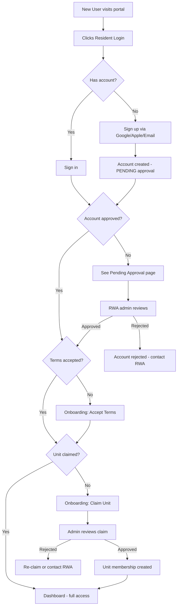
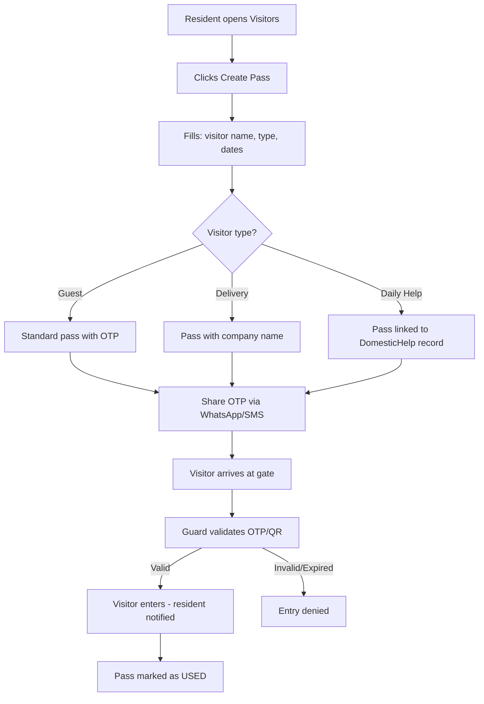
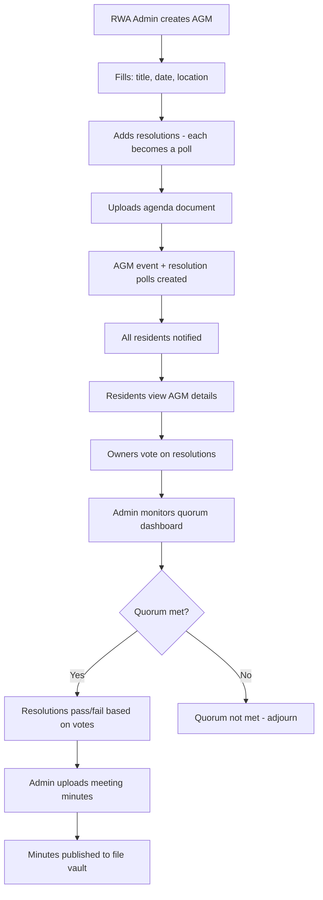
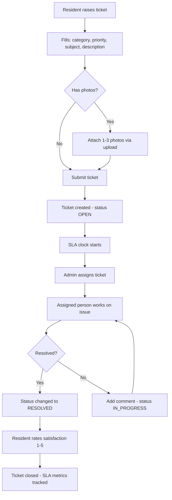

# Gulshan Dynasty Community Portal — Functional Specification

**Document type:** Functional Specification (FSD)  
**Version:** 2.0  
**Date:** 7 July 2026  
**Audience:** Product team, RWA committee, developers, residents (end-user sections)  
**Related docs:** [Specification index](./README.md) · [Roles & Permissions](./roles-and-permissions.md) · [Product Roadmap](./product-roadmap.md) · [Architecture](./architecture.md) · [Design Profiles](./design-profiles.md) · [Dev backlog](../dev/backlog.md)

---

## 1. Executive Summary

The **Gulshan Dynasty Community Portal** is a web-based platform for the Residents' Welfare Association (RWA) of Gulshan Dynasty, a gated community in Sector 144, Noida. It serves **204 homes** across **3 towers** (A, B, C) and supports day-to-day community operations: notices, events, polls, maintenance tickets, amenity booking, visitor passes, **staff & vendor directories**, dues tracking, document storage, sub-community groups, and discussion forums.

**This is a resident portal, not a sales website.** It is designed for people who already live in the community — not for convincing anyone to buy a flat here. (That’s what the sales site is for.)

**July 2026 highlight:** The **Staff Registry v2** ships — one profile per person (Kamla the maid, not “Kamla at C-302” and “Kamla at B-1201” as strangers), community-wide visibility, star reviews, and gate passes that actually link to the right human.

| Attribute | Detail |
|---|---|
| Community | Gulshan Dynasty RWA |
| Location | GH-03D, Sector 144, Noida, UP 201306 |
| Units | 204 (198 apartments + 6 duplexes) |
| Unit naming | `{Tower}-{Floor}{Unit}` e.g. `C-0302` |
| Primary users | Owners, tenants, family members, RWA admins, security staff |
| Access | Web browser (desktop and mobile); login required for most features |

---

## 2. Document Structure

| Section | Primary audience | Purpose |
|---|---|---|
| §3 | Product + dev | Personas and role overview (details → [Roles doc](./roles-and-permissions.md)) |
| §4–§5 | Product team | Scope and module specifications |
| §6 | Product + QA | Business rules and workflows |
| §7 | Product team | User journey diagrams |
| §8–§12 | End users | How to use each feature |
| §13 | Product + QA | **Implementation status** (authoritative shipped list) |
| §14 | Product team | Operational KPIs |
| §15 | Product team | Pointers to roadmap and dev backlogs |
| §16 | All | Glossary |

---

## 3. User Personas & Roles

### 3.1 Personas (end-user perspective)

| Persona | Who they are | What they need |
|---|---|---|
| **Resident (Owner)** | Flat owner living in Gulshan Dynasty | Book amenities, create visitor passes, view dues, vote in polls, raise tickets |
| **Resident (Tenant)** | Rented flat occupant | Same as owner for day-to-day features; may have restricted voting/booking per society rules |
| **Family member** | Spouse/child of owner or tenant | View notices and events, raise tickets; cannot vote or book facilities |
| **RWA Admin** | Society office bearer or appointed manager | Approve users, manage units, publish notices, assign tickets, generate dues |
| **Community Admin** | Lead of a sub-group (e.g. Sports Club) | Manage club members, run scoped polls and events |
| **Security guard** | Gate staff | Validate visitor OTP/QR codes |
| **Guest / visitor (web)** | Non-logged-in user | View community hub, contact RWA, sign up for access |
| **Vendor / Contractor** | External service provider (electrician, plumber, AC repair) | View contact requests from residents; listed in RWA-vetted directory |
| **Treasurer** | RWA finance officer | Track dues collection, view defaulter aging reports, generate receipts, manage UPI payments |

### 3.2 System roles (summary)

| Role | Code | Description |
|---|---|---|
| Super Admin | `SUPER_ADMIN` | Bootstrap user; full system access |
| Admin | `ADMIN` | RWA operations (`/admin/*`) |
| Resident | `RESIDENT` | Default role after registration |
| Non-Resident | `NON_RESIDENT` | External stakeholder (limited UI today) |
| Security Staff | `SECURITY_STAFF` | Gate validation via PIN login |

> **Full permission matrix** (action × role, staff, contacts, FAQ): [Roles & Permissions](./roles-and-permissions.md)

**Unit-level roles** (time-bound, per flat): Owner, Joint Owner, Tenant, Owner's Family, Tenant's Family — a user may hold multiple memberships. See [Roles doc §1](./roles-and-permissions.md#1-role-hierarchy-quick-map).

**Sub-community roles:** Admin (club lead), Member.

**Delegated leadership** (assigned by Super Admin — not separate accounts): unit leader, community admin, facility leader. See §3.3 below and [Roles doc §1](./roles-and-permissions.md#1-role-hierarchy-quick-map).

### 3.3 Delegated leadership (v1)

Super Admin assigns operational leaders without creating new accounts:

| Scope | Field / model | Assigned by | Capabilities |
|---|---|---|---|
| Unit | `Unit.leaderUserId` | Super Admin | Invite `TENANT` / family roles; invitee accepts; cancel pending invites |
| Sub-community | `CommunityRole.ADMIN` | Super Admin | Approve joins (non-tower); scoped events/notices; forum moderation |
| Facility | `FacilityLeader` | Super Admin | Approve/reject bookings (RWA Admin always has override) |

Unit leaders cannot assign owners, remove members, or approve onboarding claims (v1). See [`delegated-leadership-archived-2026-07-07.md`](../dev/archive/delegated-leadership-archived-2026-07-07.md).

---

## 4. Product Scope

### 4.1 In scope (v1 — implemented)

| Module | Status | Notes |
|---|---|---|
| Community Hub (home page) | ✅ Live | Single-viewport resident home |
| Authentication (Google, Apple, email magic link, dev credentials) | ✅ Live | |
| User registration & admin approval | ✅ Live | |
| Onboarding enforcement (terms → unit claim → approval) | ✅ Live | Middleware redirect chain |
| Units & time-bound RBAC | ✅ Live | Hourly membership expiry cron |
| User & unit profile pages | ✅ Live | UserLink / UnitLink everywhere |
| Unit claim admin approval workflow | ✅ Live | |
| Resident directory | ✅ Live | Mobile: single-tower view below 1024px |
| Dashboard with launch readiness checklist | ✅ Live | |
| Notice board with emergency templates | ✅ Live | Acknowledgment required for emergency |
| Events & RSVP | ✅ Live | Card list (no calendar grid yet) |
| Polls & voting with eligibility enforcement | ✅ Live | Owners-only, one-per-unit |
| AGM digital pack | ✅ Live | Event + resolution polls + quorum |
| Sub-communities (clubs/groups) | ✅ Live | |
| Discussion forums | ✅ Live | Global + sub-community scoped |
| Helpdesk & ticketing with SLAs and satisfaction ratings | ✅ Live | Photo attachments (max 3) |
| Facility booking with waitlist and approval | ✅ Live | Mobile day-picker below `lg` breakpoint |
| Visitor management (pass + gate validation) | ✅ Live | |
| **Staff registry & Regular Help** (`/staff`) | ✅ Live | **New Jul 2026** — see §5.11 |
| **Important contacts with reviews** (`/contacts/[id]`) | ✅ Live | **New Jul 2026** — see §5.12 |
| Delivery management | ✅ Live | |
| Parking & vehicle registry | ✅ Live | |
| Move-in / move-out workflow | ✅ Live | |
| Emergency broadcast with acknowledgment | ✅ Live | |
| Dues ledger with UPI QR payment | ✅ Live | Ledger + QR; no payment gateway |
| Defaulter aging report | ✅ Live | |
| File vault (global documents) | ✅ Live | |
| RWA committee page | ✅ Live | |
| **Help & FAQ** (`/faq`, `/faq/app`) | ✅ Live | **New Jul 2026** — see §5.19 |
| In-app notifications with preferences | ✅ Live | Per-category toggles |
| Global search (Cmd+K) | ✅ Live | 11 entity types; staff/contacts search deferred |
| Admin role guard on `/admin/*` | ✅ Live | |
| Security staff PIN login | ✅ Live | 30-day gate session |
| Gate offline cache (service worker) | ✅ Live | |
| Lost & Found board | ✅ Live | |
| Pet registration | ✅ Live | |
| Facility usage analytics | ✅ Live | |
| Delegated leadership (unit / club / facility leaders) | ✅ Live | v1 — see §3.3 |
| Privacy & Terms pages | ✅ Live | |
| Contact RWA enquiry form | ✅ Live | |

### 4.2 Out of scope / deferred

| Feature | Notes |
|---|---|
| Online payment gateway (Razorpay) | UPI QR implemented; Razorpay deferred pending RWA approval |
| GST-compliant receipt PDF | BLOCKED — needs RWA GSTIN |
| Email notifications (bulk) | In-app + preferences work; React Email templates deferred |
| SMS / push notifications | Not in v1 |
| Real-time chat | WhatsApp used informally |
| Recurring events (weekly yoga) | Manual event creation only |
| Tenant owner consent (NOC) workflow | Deferred — see hold-backlog.md |
| Event calendar grid view (FullCalendar) | Deferred — card list implemented |
| Sustainability dashboard | Deferred — see hold-backlog.md |
| Staff photos (MinIO upload) | Initials placeholder only — STAFF-038 |
| Staff in global search | STAFF-048 on hold |
| Admin staff orphan queue | STAFF-085 on hold |
| Hindi gate UI | hold-backlog.md IMP-504 |
| Legacy `DomesticHelp` model | Migrated to Staff Registry; deprecation cleanup on hold |

---

## 5. Functional Modules — Product Specification

### 5.1 Community Hub (Home Page)

**URL:** `/`  
**Access:** Public (guests and logged-in users see the same page with different content)

**Purpose:** Single-screen entry point to the portal — not a marketing site. Residents see live community data; guests see previews and login prompts.

| Element | Guest behavior | Logged-in resident behavior |
|---|---|---|
| Greeting | "Welcome to Gulshan Dynasty" | "Good {morning/afternoon/evening}, {FirstName} · Tower {X} · {Unit}" |
| Shortcut grid (8 tiles) | Links to `/login?callbackUrl=...` | Direct links to features |
| Live feed | Latest notices, events, polls (global) | Tower-filtered notices + personalized counts |
| Amenity chips | Links to login | Links to `/facilities` |
| Community pulse | Stats: 204 homes, 3 towers, IGBC Platinum | Same + optional weather |
| Contact RWA | Dialog form | Dialog form |

**Shortcut tiles:** Book Amenity · Visitor Pass · Raise Ticket · My Dues · Notices · Events · Polls · Directory

**Acceptance criteria (product):**
- Fits one desktop viewport without scrolling
- No full-page hero carousel or sales copy
- Badge counts on tiles when resident has open items (tickets, dues, notifications)

---

### 5.2 Authentication & Onboarding

**URLs:** `/login`, `/onboarding/terms`, `/onboarding/unit-claim`, `/pending`

#### Registration flow

```
Sign in (Google / Apple / Email magic link)
        │
        ▼
New user created → approvalStatus = PENDING
        │
        ▼
(Optional) Accept terms → /onboarding/terms
        │
        ▼
(Optional) Claim unit → /onboarding/unit-claim
        │
        ▼
Wait for admin approval → /pending (informational)
        │
        ▼
Admin approves → user can access portal
        │
        ▼
Redirect to /dashboard (or home)
```

**Business rules:**
- Registration is **not automatic** — admin must approve every new account
- Email is the unique identifier; same email across Google/Apple is linked to one account
- Deactivated users (`isActive = false`) cannot access the portal
- Terms acceptance and unit claim are **enforced** via middleware redirect chain after login

#### Admin approval actions

| Action | Effect |
|---|---|
| Approve | Sets `APPROVED`; sends in-app notification |
| Reject | Sets `REJECTED`; user cannot access features |
| Deactivate | Sets `isActive = false`; invalidates sessions |
| Change role | Updates global role (Admin, Resident, etc.) |

---

### 5.3 Units & Residency

**URLs:** `/admin/units`, `/admin/units/[id]`, `/units/[unitNumber]`, `/directory`

**Unit structure:**
- 3 towers: A, B, C
- 34 floors × 2 units per floor = 204 units
- Naming: `A-0101`, `B-1702`, `C-3402`
- Floors 33–34 may be duplex units

**Admin capabilities:**
- View all units with occupancy status (occupied / vacant)
- Filter by tower and floor
- Assign user to unit with role and date range
- Support multiple owners (joint owners) on one unit
- **Ownership transfer:** atomic operation — close old membership, open new one
- View full membership history per unit

**Resident capabilities:**
- View own unit(s) and role(s) on profile
- Browse **directory** — search by tower; see who lives in each flat (**names only**, no phone/email for privacy)
- **Mobile:** “All towers” hidden below 1024px; defaults to Tower A — portrait mode and three side-by-side tower grids were not getting along

**Automatic expiry:** Cron job runs hourly; memberships past `endDate` are deactivated.

---

### 5.4 User & Unit Profiles

**URLs:** `/users/[userId]`, `/units/[unitNumber]`

**Global rule:** Every user name and unit number displayed anywhere in the portal links to the respective profile page.

#### User profile sections

| Section | Self | Other resident | Admin |
|---|---|---|---|
| Name, avatar, role | View + edit | View (name, unit, role) | View + admin actions |
| Contact (email, phone) | View + edit | Hidden | View |
| Emergency contact, vehicles | View + edit | Hidden | View |
| Unit memberships | View | View (active only) | View + history |
| Sub-community memberships | View | View | View |
| RWA designation | View | View | View |
| Activity summary (polls, events, tickets) | View | Hidden | View |
| Admin actions (role, deactivate) | — | — | Available |

#### Unit profile sections

| Section | Unit resident | Other resident | Admin |
|---|---|---|---|
| Unit info (tower, floor, type, area) | View | View | View |
| Current residents (linked names) | View | View (names only) | View |
| Dues status | View | Hidden | View |
| Active visitor passes | View | Hidden | View |
| Open tickets | View | Hidden | View |
| Registered vehicles | View | Hidden | View |
| Admin actions (assign, transfer, generate due) | — | — | Available |

---

### 5.5 Notice Board

**URLs:** `/notices`, `/admin/notices/new`

**Purpose:** Official society announcements — water shutoffs, AGM dates, maintenance schedules.

| Field | Description |
|---|---|
| Title | Short headline |
| Body | Rich text content |
| Priority | Normal · Important · Emergency |
| Expiry | Optional auto-hide date |
| Target tower | Optional — notice shown only to residents of Tower A, B, or C |

**Resident experience:** Notices appear on dashboard and hub live feed, sorted by priority then date. Emergency notices are highlighted in red.

**Admin experience:** Create notice via form; emergency email blast to all residents is **Phase 2**.

---

### 5.6 Events & RSVP

**URLs:** `/events`, `/events/new`, `/events/[id]`

**Purpose:** Community gatherings — yoga classes, festivals, AGM, tower meetings.

| Capability | Who |
|---|---|
| Create event (global or sub-community scoped) | Admin, Community Admin |
| View upcoming events | All approved residents |
| RSVP (Accept / Decline / Maybe) | Residents and family members |
| View RSVP counts and attendee list | Event creator, admin |

**Scope:**
- **Global** — visible to all residents
- **Sub-community** — visible to group members only

**Note:** Calendar grid view (month/week) is Phase 2. Current UI is a card list.

---

### 5.7 Polls & Voting

**URLs:** `/polls`, `/polls/new`, `/polls/[id]`

**Purpose:** Community decisions — AGM resolutions, feedback surveys, committee elections.

| Setting | Options |
|---|---|
| Scope | Global (all residents) or sub-community |
| Anonymous voting | Yes / No |
| Result visibility | Live during poll · After poll closes |
| Multi-select | Up to N choices per voter |
| Eligibility | All residents · Owners only · One vote per unit *(stored, not yet enforced)* |
| RWA resolution | Quorum percentage required *(display only)* |

**Voting rules:**
- One vote per user per poll (or up to `maxChoices` for multi-select)
- Cannot change vote after submission
- Polls auto-close at configured end date/time

---

### 5.8 Sub-Communities (Clubs & Groups)

**URLs:** `/communities`, `/communities/[id]`, `/admin/communities`

**Purpose:** Interest-based groups within the society — Sports Club, Garden Club, Book Club, etc.

| Action | Who |
|---|---|
| Create / archive community | Admin |
| Assign community admin | Admin |
| Add / remove members | Community Admin |
| Request to join | Any resident |
| Approve / reject join request | Community Admin |

Each sub-community has its own page with: description, member list, scoped polls, scoped events, and file vault (when enabled).

---

### 5.9 Helpdesk & Ticketing

**URLs:** `/tickets`, `/tickets/new`, `/tickets/[id]`, `/admin/tickets`

**Purpose:** Maintenance and service requests — plumbing, electrical, housekeeping, security.

| Field | Description |
|---|---|
| Category | Plumbing · Electrical · Civil · Housekeeping · Security · Other |
| Priority | Low · Medium · High · Urgent |
| Subject & description | Free text |
| Unit | Auto-linked to resident's unit |

**Workflow:**

```
Resident raises ticket (OPEN)
        │
        ▼
Admin views / assigns (IN_PROGRESS)
        │
        ▼
Assignee adds comments, updates status
        │
        ▼
RESOLVED → CLOSED
```

**Resident:** Track own tickets, add comments, attach up to 3 photos, view status timeline and SLA indicator.  
**Admin:** View all tickets, filter by status/category, update status, assign (Phase 2).

---

### 5.10 Facility Booking

**URLs:** `/facilities`, `/facilities/[id]`

**Bookable amenities (seed data):**
- Swimming Pool & Sun Deck
- Rooftop Recreation Center & Sky Deck
- Spa & Wellness Center
- Mini Theatre
- Amphitheater
- Cricket Pitch
- Skating Rink

| Rule | Default |
|---|---|
| Slot duration | 60 minutes |
| Advance booking window | 7 days |
| Max bookings per user | 2 active |
| Cancellation cutoff | 60 minutes before slot |
| Capacity | 1 (exclusive) or N (shared, e.g. pool) |

**Booking flow:**
1. Resident selects facility
2. Views availability grid (open slots shown; blackouts grayed out)
3. Clicks slot → confirms booking
4. Can cancel if > 60 min before start

**Admin:** Create facilities, set blackout periods (maintenance closures).

**Mobile UX (Jul 2026):** Below the `lg` breakpoint, booking uses a **day picker + scrollable slot list** with full-width touch targets (`min-h-11`). The week grid remains on desktop — because squinting at 7 columns on a phone helps no one.

---

### 5.11 Staff Registry & Regular Help

**URLs:** `/staff` · `/staff/[id]` · `/staff/search` (associate flow)  
**Nav:** Header “Help” pill · Mobile bottom nav “Help” · Unit profile household staff section

**Purpose:** One canonical record per non-resident person who regularly enters the society — maids, cooks, drivers, society guards, facility crew. Residents discover, associate, review, and (for unit staff) manage gate access without re-typing “Kamla” seventeen times.

#### Two kinds of staff (do not mix them up)

| Type | Roles | Scope | Who manages |
|---|---|---|---|
| **Unit staff** | Maid, Nanny, Cook, Driver, Gardener, Other | Linked to one or more flats | Any active member of that unit |
| **Society staff** | Guard, Facility, Electrician, Plumber | GD-wide (`scope = SOCIETY`) | Admin / seed data — **not** addable to your flat |

Trying to associate a guard with C-1702 will politely fail. Guards work for the society, not your spare bedroom.

#### Regular Help page (`/staff`)

| Feature | Behavior |
|---|---|
| **Scope filter** | “All help” (community-wide) or “My unit” |
| **Role filter pills** | Icon + count per role; horizontal scroll on mobile |
| **One card per person** | Multiple unit numbers on same tile if maid works at 2 flats |
| **Star rating** | Aggregate from `StaffReview` |
| **Add / Remove icons** | Only when caller can associate or end a **unit** link — never for society staff |
| **Profile link** | Name → `/staff/[id]` via `<StaffLink />` |

**Search-first registration:** Before creating a duplicate, residents search by name (≥2 chars) or phone (exact, ≥10 digits). Phone is never shown in resident-facing APIs — guards see it only at validation time.

#### Staff profile (`/staff/[id]`)

- Role badges by unit (active + “Previously at …” for ended associations)
- Review form — approved residents only; one review per author per staff
- “Add to my unit” CTA when not yet linked

#### Gate passes

- Cron at **6 AM IST** generates `DAILY_HELP` passes linked via `staffPersonId`
- Staff passes **exempt** from BR-07 (10 active passes per resident)
- Gate shows all linked units + staff photo placeholder (initials until MinIO upload ships)

**Permissions:** See [Roles & Permissions](./roles-and-permissions.md) §3.

**Backlog (on hold):** Staff photos, global search indexing, orphan association admin queue, unit notifications on add/remove — [`backlog-staff-registry.md`](../dev/backlog-staff-registry.md).

---

### 5.12 Important Contacts (Vendor Directory)

**URLs:** `/contacts` · `/contacts/[id]`

**Purpose:** RWA-vetted **businesses and service lines** — electricians, couriers, laundry, club booking numbers. Complements staff registry: **people** live at `/staff/[id]`, **vendors** live at `/contacts/[id]`.

| Feature | Behavior |
|---|---|
| List page | Category filters, search, ★ average on cards, tap → detail |
| Detail page | Phone (click-to-call), reviews, “Added by” / “Last updated by” with UserLink |
| Reviews | 1–5 stars + comment; edit/delete own; `Internal Intercom` category not reviewable |
| Create / edit | Approved residents; creator or admin can edit |
| Cross-link | Banner to Regular Help for individual domestic staff |

**Seed data:** ~80 contacts across 15+ categories (`npm run db:seed:contacts`).

---

### 5.13 Visitor Management

**URLs:** `/visitors`, `/visitors/new`, `/visitors/[id]`, `/gate`

**Purpose:** Digital gate passes for guests, delivery personnel, daily help, cab drivers.

| Field | Description |
|---|---|
| Visitor name & phone | Required / optional |
| Visitor type | Guest · Delivery · Daily Help · Cab · Other |
| Destination unit | Required — guard sees which flat |
| Validity window | From / until datetime |
| Recurring | Optional — specific days of week (for maids/cooks) |
| Parking slot | Optional |

**On creation:** System generates a **6-digit OTP** and **QR code**.

**Resident actions:**
- Share pass via **WhatsApp** (pre-filled message with OTP and unit)
- View active and past passes
- Cancel pass

**Gate validation (`/gate`):**
- Security enters OTP
- System shows: visitor name, destination unit, pass type, valid/invalid/expired
- Valid pass marked as USED (single-use) or validated (recurring)

**Limits:** Max 10 active passes per resident (staff cron passes exempt — see §5.11).

**Legacy note:** `/visitors?tab=help` redirects to `/staff`. Daily help is no longer a visitors tab — it grew up and moved out.

---

### 5.14 Dues & Payments

**URLs:** `/dues`, `/admin/dues`

**Purpose:** Track maintenance charges — ledger + UPI QR; no in-app payment gateway yet.

| Resident sees | Admin can do |
|---|---|
| Dues for their unit(s) | Generate dues for all 204 units (bulk) |
| Status: Pending · Paid · Overdue · Waived | Mark individual due as paid |
| Payment history | Attach receipt (file upload) |
| Outstanding total | Financial summary report |

**Reminders:** Cron job marks overdue dues and can trigger notifications (email reminders Phase 2).

**Currency:** Amounts in INR (₹).

---

### 5.15 File Vault

**URL:** `/files`

**Purpose:** Society-wide document storage — bylaws, AGM minutes, registration certificates.

| Rule | Value |
|---|---|
| Max file size | 25 MB |
| Allowed types | PDF, DOCX, XLSX, images |
| Upload | Admin only (global vault) |
| Download | All approved residents |
| Storage | MinIO (S3-compatible), self-hosted |

Sub-community scoped file vaults are supported in schema; global vault is the primary implemented UI.

---

### 5.16 RWA Committee

**URLs:** `/committee`, `/admin/committee`

**Purpose:** Display current office bearers — President, Secretary, Treasurer, Committee Members.

| Field | Description |
|---|---|
| User | Linked to resident profile |
| Title | Office held |
| Term | Start and end dates |

Public page shows current designations. Admin page manages appointments.

---

### 5.17 Notifications

**URL:** `/notifications` (inbox); bell icon in header

**Channels (v1):** In-app + user preferences per category

| Trigger | Notification type |
|---|---|
| Account approved | Approval granted |
| New poll created | New poll |
| New event published | New event |
| Ticket status changed | Ticket update |
| Notice published | Notice published |
| Join request approved | Community join approved |
| Visitor / staff arrived at gate | Visitor arrived |
| Staff associated / ended | Deferred (STAFF-077) |

Unread count shown on bell icon. Mark individual or all as read.

**Phase 2:** Email templates for bulk/off-portal delivery.

---

### 5.18 Admin Tools

**URLs:** `/admin`, `/admin/audit`, `/admin/export`

| Tool | Purpose |
|---|---|
| Admin dashboard | Counts: pending approvals, open tickets, unit onboarding progress |
| Audit log | Filterable log of admin actions (approve user, role change, file delete, etc.) |
| CSV export | Members list, dues report, tickets summary |
| Global search | Cmd+K — search residents by name, units by number |

---

### 5.19 Help & FAQ

**URLs:** `/faq` (guests), `/faq/app` (logged-in), `/faq/manage` (editors)

**Purpose:** Public help articles for residents and visitors — gate passes, dues, amenities, and society rules. Organized in sections with rich-text answers (images supported).

| Capability | Who |
|---|---|
| Read published FAQs | Anyone (guest `/faq`; logged-in users redirected to `/faq/app`) |
| In-page search | Anyone on `/faq` or `/faq/app` |
| Create / edit / publish | Super Admin, Admin, or any active RWA committee designation |
| Hub shortcut tile | Shown when ≥1 published FAQ exists; session-aware link |

**Publishing rules:** Both section and item must be `isPublished` to appear publicly. Editors self-publish (no separate approval workflow).

**Navigation:** Login footer, hub tile (conditional), mobile More menu, admin sidebar → `/faq/manage`, leader hub “Edit FAQ” for editors.

---

## 6. Business Rules Summary

| # | Rule |
|---|---|
| BR-01 | Every new user account requires admin approval before portal access |
| BR-02 | A user may belong to multiple units with different roles simultaneously |
| BR-03 | Unit membership access expires automatically on `endDate` |
| BR-04 | Family members can view content and raise tickets but cannot vote or book facilities |
| BR-05 | One vote per user per poll (or up to N choices if multi-select enabled) |
| BR-06 | Visitor passes are linked to a destination unit — guard always sees which flat |
| BR-07 | Max 10 active visitor passes per resident |
| BR-08 | Facility bookings prevent double-booking via database constraint |
| BR-09 | Notices can be targeted to a specific tower; untargeted = all residents |
| BR-10 | Dues are per-unit; reminders go to primary contact (`isPrimary = true`) |
| BR-11 | User names and unit numbers are always clickable links to profile pages |
| BR-12 | Directory shows resident names only — no phone or email (privacy) |
| BR-13 | All dates stored in UTC; displayed in IST (Asia/Kolkata) |
| BR-14 | Deactivated users are immediately logged out on next request |
| BR-15 | Ticket SLA: Urgent = 4 hours, High = 24 hours, Medium = 48 hours, Low = 72 hours |
| BR-16 | SLA deadline is computed from ticket `createdAt` + SLA hours for the priority level |
| BR-17 | SLA status displayed on ticket detail: green (ok), amber (warning ≤4h remaining), red (breached) |
| BR-18 | Ticket satisfaction rating (1–5 stars) is only available after ticket status is CLOSED or RESOLVED |
| BR-19 | Poll eligibility enforced: ALL_RESIDENTS = any active membership; OWNERS_ONLY = OWNER or JOINT_OWNER role; ONE_PER_UNIT = one vote per unit regardless of user |
| BR-20 | Emergency notices require acknowledgment before user can access other portal features |
| BR-21 | Staff daily passes auto-generated at 6 AM IST via cron; linked to `StaffPerson` via `staffPersonId` |
| BR-27 | Staff phone visible to guards at gate validation only — never in resident APIs |
| BR-28 | Max 5 active unit associations per staff person |
| BR-29 | Society staff roles (Guard, Facility, Electrician, Plumber) cannot be unit-associated by residents |
| BR-30 | Staff reviews require approved resident; one review per author per staff |
| BR-31 | Contact reviews: `Internal Intercom` category not reviewable; phone shown on vendor detail page |
| BR-22 | Move-out requests block unit access until dues are cleared (status PAID for all PENDING dues) |
| BR-23 | Facility waitlist users are notified when a slot opens; first to confirm gets the booking |
| BR-24 | Security staff PIN login creates a 30-day session; only gate routes accessible |
| BR-25 | Notice body text truncated to 4 lines in list view; full text on detail page |
| BR-26 | Ticket photo attachments max 3 images, max 25MB each, images only |

---

## 7. User Journey Diagrams

### 7.1 Onboarding Journey



### 7.2 Visitor Pass Journey



### 7.3 AGM Digital Pack Journey



### 7.4 Maintenance Ticket Journey



---

## 8. End-User Guide — Residents

### 8.1 Getting started

1. Open the portal URL in your browser
2. Click **Resident Login** on the home page
3. Sign in with **Google**, **Apple**, or **email magic link**
4. Wait for RWA admin to approve your account (you may see a "Pending Approval" message)
5. Once approved, you'll receive an in-app notification
6. Visit your **Profile** to add phone, emergency contact, and vehicle details

### 8.2 Daily tasks — quick reference

| I want to… | Go to… |
|---|---|
| See what's happening | Home (`/`) or Dashboard |
| Read a society notice | Notices |
| Book the pool or theatre | Facilities → select amenity → pick slot |
| Invite a guest | Visitors → New Pass → share OTP via WhatsApp |
| Report a leak / issue | Tickets → New Ticket |
| Check my maintenance bill | Dues |
| Vote in a society poll | Polls → open poll → cast vote |
| RSVP to an event | Events → event detail → Accept/Decline |
| Find who lives in a flat | Directory (filter by tower) |
| Manage maid / cook / driver | Regular Help (`/staff`) |
| Rate a plumber or courier | Contacts → detail → review |
| Find RWA-vetted vendor phone | Contacts |
| Join a club | Communities → Request to Join |
| Download society bylaws | Files |
| See RWA office bearers | Committee |

### 8.3 Creating a visitor pass (step-by-step)

1. Go to **Visitors** → **New Pass**
2. Enter visitor name and phone (optional)
3. Select type: Guest / Delivery / Daily Help / Cab
4. Set validity window (from date/time to until date/time)
5. For daily help: enable **Recurring** and select days (Mon–Sat)
6. Optionally add parking slot
7. Click **Create** — you'll see a 6-digit OTP and QR code
8. Tap **Share via WhatsApp** to send the OTP to your guest
9. Guest shows OTP at the gate; security validates on `/gate`

### 8.4 Booking an amenity (step-by-step)

1. Go to **Facilities**
2. Select amenity (e.g. Swimming Pool)
3. View the weekly availability grid
4. Click an open (green) slot
5. Confirm booking
6. To cancel: go to your bookings → Cancel (must be > 1 hour before slot)

### 8.5 Raising a maintenance ticket (step-by-step)

1. Go to **Tickets** → **New Ticket**
2. Select category (Plumbing, Electrical, etc.)
3. Set priority
4. Write subject and description
5. Submit — ticket number assigned
6. Track progress on **Tickets** page; add comments as needed

---

## 9. End-User Guide — Family Members

Family members (Owner's Family / Tenant's Family) have a **subset** of resident capabilities:

| Can do | Cannot do |
|---|---|
| View notices, events, polls | Vote in polls |
| RSVP to events | Book facilities |
| Raise help tickets | Generate visitor passes (depends on unit role — verify with admin) |
| View own profile | Access admin features |

---

## 10. End-User Guide — Community Admins (Club Leads)

If you are assigned as **Community Admin** of a sub-community (e.g. Sports Club):

| Task | How |
|---|---|
| View your community | Communities → your club |
| Add/remove members | Community detail → Members tab |
| Approve join requests | Admin notification or community page |
| Create club poll | Polls → New → scope = your community |
| Create club event | Events → New → scope = your community |
| Upload club documents | Community files tab (when enabled) |

You cannot manage users, units, or society-wide notices — those are RWA Admin functions.

---

## 11. End-User Guide — Security Staff

**Primary task:** Validate visitor passes at the gate.

1. Open **`/gate`** on the gate tablet/phone (PIN login available at `/gate/login`)
2. Ask visitor for their 6-digit OTP (or scan QR)
3. Enter OTP in the validation field
4. System shows:
   - **Valid:** Visitor name, destination unit, pass type, linked staff units if applicable → allow entry
   - **Invalid / Expired:** Deny entry; ask resident to generate new pass

**Note:** Staff-linked passes show all associated units and guard-only phone number for verification.

---

## 12. End-User Guide — RWA Administrators

### 12.1 Admin dashboard (`/admin`)

Overview cards:
- Pending user approvals
- Total units / occupied count
- Open tickets
- Quick links to common tasks

### 12.2 User management (`/admin/users`)

| Task | Steps |
|---|---|
| Approve new resident | Users → Pending tab → Approve |
| Reject registration | Users → Reject |
| Assign role | User detail → Change Role dropdown |
| Deactivate account | User detail → Deactivate |
| Assign to unit | Units → unit detail → Assign Member |

### 12.3 Unit management (`/admin/units`)

| Task | Steps |
|---|---|
| View occupancy | Units → filter by tower/floor |
| Assign resident to unit | Unit detail → Assign (role + dates) |
| Transfer ownership | Unit detail → Transfer Ownership (atomic) |
| View history | Unit detail → Membership Timeline |

**Bulk import:** CSV import of units and residents is Phase 2. Currently use Excel seed script (`prisma/seed-directory.ts`) for initial data load.

### 12.4 Publishing a notice

1. Admin → Notices → New
2. Enter title, body, priority
3. Optionally set expiry and target tower
4. Publish — all matching residents see it immediately

### 12.5 Generating maintenance dues

1. Admin → Dues
2. Enter label (e.g. "Maintenance Q1 2026"), amount, due date
3. Click **Generate for All Units** — creates 204 due records
4. When payment received offline: find due → Mark Paid → attach receipt

### 12.6 Other admin tasks

| Task | Location |
|---|---|
| Create sub-community | Admin → Communities → New |
| Manage RWA committee | Admin → Committee |
| Manage FAQ content | Admin sidebar → FAQ, or `/faq/manage` |
| View audit log | Admin → Audit |
| Export member/dues/ticket CSV | Admin → Export |
| Review join requests | Admin → Communities |

---

## 13. Implementation Status & Known Gaps

*For product team and QA — reflects codebase as of **7 July 2026**. If this section disagrees with the code, trust the code (and file a bug).*

### 13.1 Shipped & stable

Authentication, onboarding enforcement, admin approval, hub, dashboard, notices (+ emergency ack), events, polls (+ eligibility), tickets (+ photos + SLAs + ratings), facilities (+ waitlist + mobile booking), visitors + gate (+ PIN + offline cache), **staff registry + Regular Help**, **contacts + reviews**, delivery, parking, move-in/out, emergency broadcast, AGM pack, dues + UPI QR + defaulter report, file vault, sub-communities, **forums**, committee, **Help & FAQ**, notifications + preferences, audit log, CSV export, global search (v1), profiles, directory (+ mobile tower UX), delegated leadership, pets, lost & found, facility analytics.

### 13.2 Partial / on hold

| Gap | Status | Backlog |
|---|---|---|
| Staff photos | Initials placeholder only | STAFF-038 |
| Staff in global search | Not indexed | STAFF-048 |
| Contacts in global search | Not indexed | CONT-028 |
| Orphan staff when unit vacant | No admin queue UI | STAFF-085 |
| Notify unit on staff add/remove | Not implemented | STAFF-077 |
| Legacy `DomesticHelp` cleanup | Migrated; model deprecation pending | STAFF-020 |
| Dues UPI block on small phones | Dense layout | Mobile audit |
| Admin tables on mobile | Horizontal scroll (by design) | CAS-017 |
| GST PDF receipts | Blocked on RWA GSTIN | IMP-402 |
| Razorpay payments | Deferred | Phase 3 |
| Email bulk notifications | In-app only | hold-backlog E14 |
| Event calendar grid | List view only | E6-S2 |
| Hindi gate UI | English only | IMP-504 |

### 13.3 Non-functional requirements (target)

| Category | Target |
|---|---|
| Performance | < 2s page load; Lighthouse ≥ 90 |
| Mobile | Responsive; touch targets ≥ 44px; 16px inputs on mobile |
| Security | HTTPS, CSRF (server actions), rate limiting on API (100/min/IP) |
| Availability | 99.5% uptime target |
| Backup | Daily DB backup, 30-day retention |
| Timezone | IST display, UTC storage |

---

## 14. Product KPIs

| KPI | Target | Measurement | Frequency |
|---|---|---|---|
| **Onboarding completion rate** | ≥ 80% of approved users complete onboarding within 7 days | (users with `termsAcceptedAt` + active membership) / (approved users) | Weekly |
| **Ticket SLA compliance** | ≥ 90% of tickets resolved within SLA (Urgent 4h, High 24h, Medium 48h, Low 72h) | (tickets resolved before SLA deadline) / (total resolved tickets) | Weekly |
| **Poll participation rate** | ≥ 50% of eligible voters cast a vote on active polls | (unique voters on poll) / (eligible users per poll eligibility rule) | Per poll |
| **Dues collection rate** | ≥ 85% of dues paid before due date | (dues marked PAID before dueDate) / (total dues generated) | Monthly |
| **Visitor pass utilization** | ≥ 60% of generated passes are used (USED status) | (passes with status USED) / (total passes generated in period) | Monthly |
| **Facility booking utilization** | ≥ 70% of available slots booked | (booked slots) / (total available slots across all facilities) | Monthly |
| **Notification engagement** | ≥ 40% of notifications read within 24 hours | (notifications read within 24h) / (total notifications sent) | Weekly |
| **Resident satisfaction** | ≥ 4.0 average ticket satisfaction rating | (sum of ratings) / (count of rated tickets) | Monthly |

### 14.1 How to track KPIs

- **Onboarding rate:** Query `User` where `approvalStatus = APPROVED` and divide by users with both `termsAcceptedAt` set AND at least one active `UnitMembership`.
- **SLA compliance:** Use `lib/tickets.ts` helpers (`isSLABreached`) on resolved tickets.
- **Poll participation:** Query `Vote` count per poll against eligible user count.
- **Dues collection:** Query `Due` records where `status = PAID` and `paidAt ≤ dueDate`.
- **Visitor pass utilization:** Query `VisitorPass` records and compare `USED` vs total.
- **Facility booking utilization:** Query `FacilityBooking` slots vs facility capacity × time windows.
- **Notification engagement:** Query `Notification` where `isRead = true` and `createdAt` within 24h.
- **Satisfaction:** Average `satisfactionRating` on `HelpTicket` where `satisfactionRating IS NOT NULL`.

---

## 15. Deferred & Future Work

| Resource | Contents |
|---|---|
| [Product Roadmap](./product-roadmap.md) | Quarterly themes, RWA committee decisions, competitive positioning |
| [Product Roadmap §2.2](./product-roadmap.md#22-next-up--on-hold--ideas-q3q4-2026) | Prioritized ideas not yet committed |
| [Staff & contacts backlog](../dev/backlog-staff-registry.md) | 68 done · 28 on hold |
| [Global search backlog](../dev/backlog-global-search.md) | 22 done · 10 remaining |
| [FAQ backlog](../dev/backlog-faq.md) | Feature complete · 4 items in hold-backlog |
| [Hold backlog](../dev/hold-backlog.md) | All deferred / Phase 2+ features |

---

## 16. Glossary

| Term | Definition |
|---|---|
| **RWA** | Residents' Welfare Association — the governing body of the society |
| **Unit** | One flat/apartment/villa identified by tower-floor-number (e.g. A-0302) |
| **Membership** | Time-bound link between a user, a unit, and a role (Owner, Tenant, etc.) |
| **Sub-community** | Internal club or group (Sports Club, Book Club) |
| **OTP** | One-time 6-digit passcode for visitor gate entry |
| **Due** | A maintenance charge billed to a unit |
| **Notice** | Official society announcement |
| **Resolution** | Formal poll requiring quorum (AGM decisions) |
| **Primary contact** | Designated member of a unit who receives official communications |
| **Hub** | The community home page (`/`) with shortcuts and live feed |
| **StaffPerson** | Canonical record for a non-resident individual (maid, guard, etc.) |
| **StaffAssociation** | Time-bound link between a staff person and a unit (or society scope) |
| **Regular Help** | Resident-facing staff directory at `/staff` |
| **Important Contact** | RWA-vetted vendor/business entry at `/contacts/[id]` |
| **Society staff** | GD-wide roles (Guard, Facility, Electrician, Plumber) — not unit-owned |
| **Unit staff** | Flat-specific roles (Maid, Cook, Driver, etc.) |
| **IGBC Platinum** | Indian Green Building Council's highest green certification |

---

## 17. Document History

| Version | Date | Author | Changes |
|---|---|---|---|
| 2.1 | 2026-07-07 | System | Spec docs reorganized; §3.2/§15 deduplicated; architecture path fixed |
| 2.0 | 2026-07-07 | System | Staff Registry v2 (§5.11), Important Contacts reviews (§5.12), mobile UX updates, rewritten §13 status, new Roles & Permissions doc, roadmap refresh |
| 1.1 | 2026-07-05 | System | Updated scope, KPIs, SLA rules, personas, user journeys |
| 1.0 | 2026-07-05 | System | Initial FSD from architecture + codebase review |

---

*For permissions, see [Roles & Permissions](./roles-and-permissions.md). For technical architecture, see [Architecture](./architecture.md). For development tracking, see [Dev backlog](../dev/backlog.md).*
